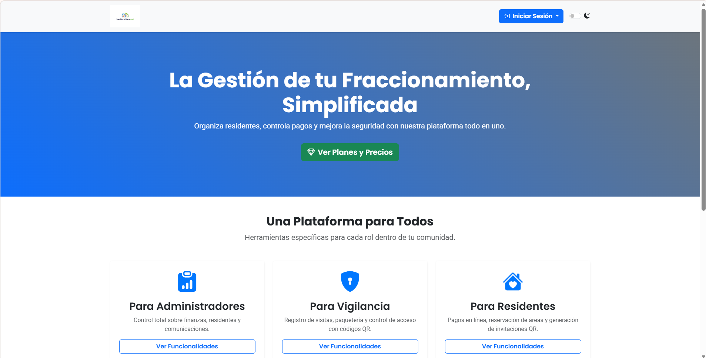
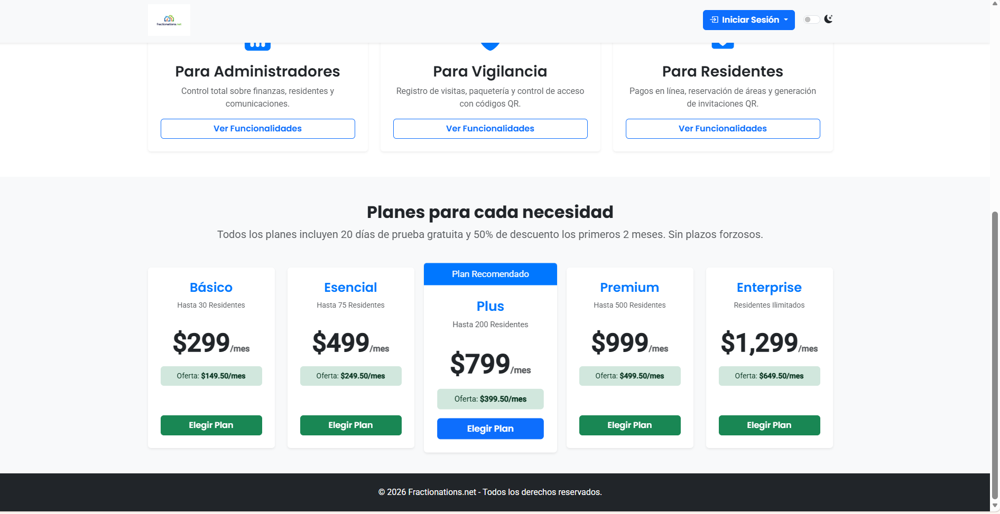
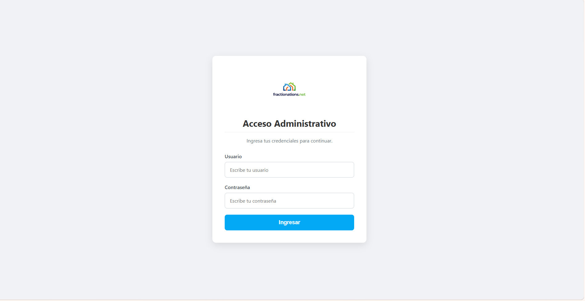
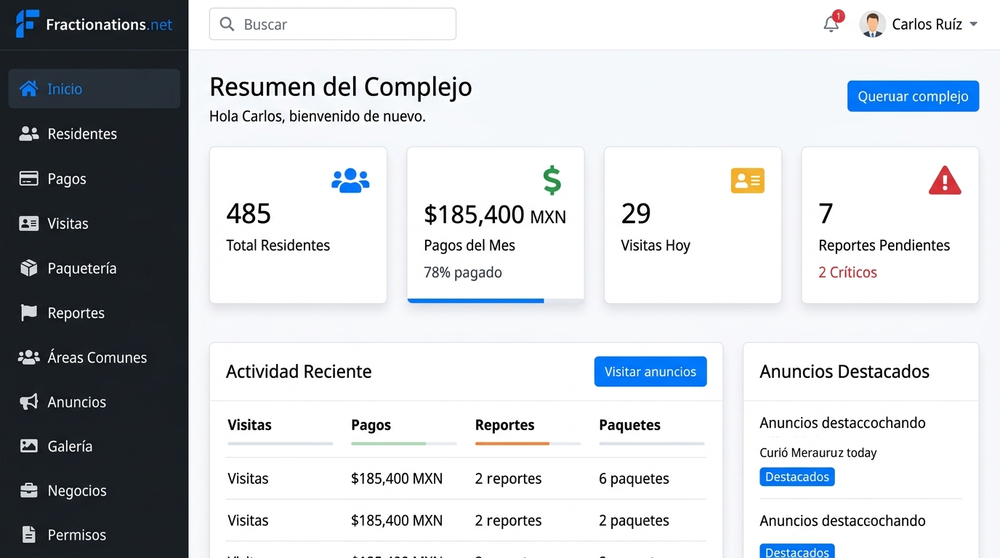
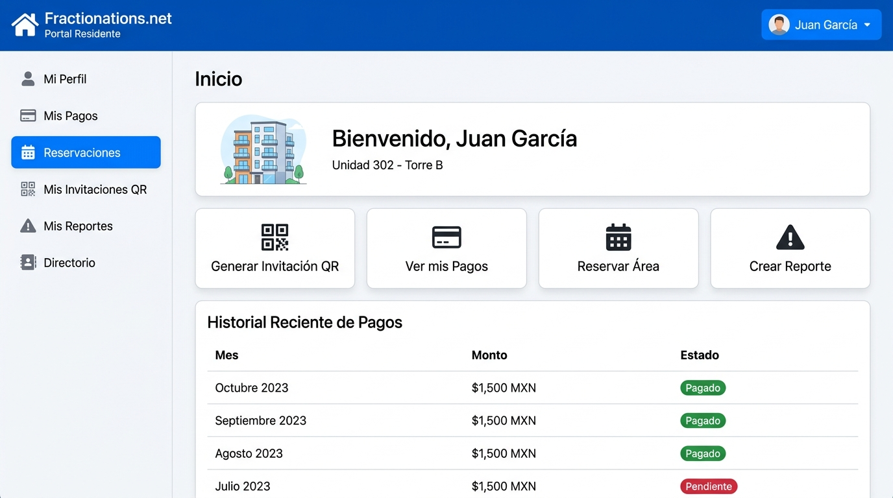

# 🏘️ Fractionations.net — Plataforma SaaS de Gestión de Fraccionamientos

> Sistema **multi-tenant** todo en uno para administrar fraccionamientos y condominios. Controla residentes, pagos, seguridad, áreas comunes y comunicación desde un solo panel — con planes de suscripción por capacidad.

---

## 📸 Vistas del Sistema

**Landing Page**
| Hero | Planes y Precios |
|---|---|
|  |  |

**Acceso al Sistema**
| Login Admin | Login Residente |
|---|---|
|  |  |

**Dashboards** *(referencia visual)*
| Panel de Administración | Portal del Residente |
|---|---|
|  |  |

---

## ✨ Módulos del Sistema

### 👔 Panel de Administración (Admin del fraccionamiento)
- 👥 Gestión completa de **residentes** (CRUD, importación por plantilla Excel)
- 💰 **Control de pagos** y cuotas de mantenimiento
- 🚗 Control de **visitas y paquetería** con registro de placas
- 📋 **Reportes** de incidencias
- 🗓️ **Reservación de áreas comunes**
- 📢 **Gestión de anuncios** para la comunidad
- 🏪 Directorio de **negocios locales**
- 🖼️ **Galería** fotográfica del fraccionamiento
- 🔑 Sistema de **permisos granulares** por rol
- 🔐 Generación de **credenciales** para residentes

### 🏠 Portal del Residente
- 💳 Ver historial de **pagos** y estado de cuenta
- 📨 Generar **invitaciones con código QR** para visitas
- 🗓️ **Reservar áreas comunes**
- 📣 Crear y seguir **reportes** de problemas
- 👤 Gestión de **perfil y datos personales**

### 🌐 Superadmin (Multi-tenant)
- 🏗️ Crear y gestionar **múltiples fraccionamientos**
- 💼 Gestión de **planes de suscripción**
- 👤 Administración de **usuarios globales**
- 📊 Verificación de **suscripciones activas**

---

## 💼 Planes de Suscripción

| Plan | Residentes | Prueba |
|---|---|---|
| Básico | Hasta 30 | ✅ 20 días gratis |
| Esencial | Hasta 75 | ✅ 20 días gratis |
| Plus ⭐ | Hasta 200 | ✅ 20 días gratis |
| Premium | Hasta 500 | ✅ 20 días gratis |
| Enterprise | Ilimitados | ✅ 20 días gratis |

---

## 🛠️ Tecnologías


| Tecnología | Uso |
|---|---|
| **PHP** | Backend completo, lógica de negocio |
| **MySQL** | Base de datos de residentes, pagos y configuración |
| **Bootstrap 5** | UI responsive con Poppins + Roboto |
| **Bootstrap Icons** | Iconografía del sistema |
| **QR Codes** | Control de acceso e invitaciones |
| **AOS.js** | Animaciones en la landing page |

---

## 📁 Estructura del Proyecto

```
fractionations.net/
├── index.php              # Landing page con planes y precios
├── img/                   # Logo e imágenes de la plataforma
├── portal/                # Panel del residente
│   ├── login.php
│   ├── dashboard_residente.php
│   ├── reservaciones.php
│   ├── invitaciones.php
│   └── ...
├── superadmin/            # Panel multi-tenant
│   ├── index.php
│   ├── crear_fraccionamiento.php
│   └── gestion_planes.php
├── tareas/                # Módulo de tareas
└── uploads/               # Archivos subidos (logos, fotos, reportes)
    ├── logos/
    ├── galeria/
    ├── reportes/
    └── identificaciones/
```

*(El panel de administración contiene 50+ módulos PHP)*

---

## 📌 Estado del Proyecto


---

## 🔗 Volver al Portafolio

[← Regresar al índice principal](../README.md)
