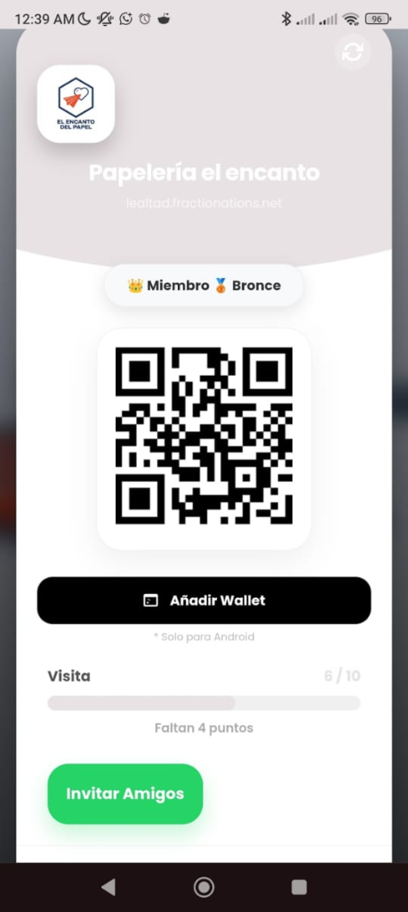
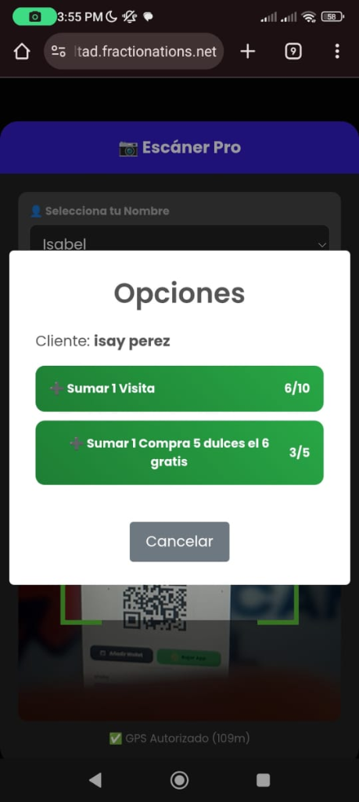
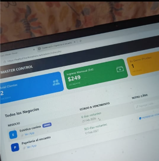
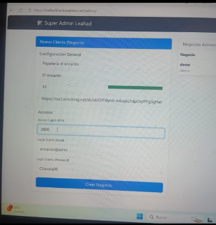

# 🏆 Plataforma SaaS de Lealtad QR (Multi-Tenant)

> Sistema integral "Software as a Service" (B2B) diseñado para digitalizar las tarjetas de lealtad de comercios locales. Permite a los negocios crear programas de puntos escaneables y fidelizar clientes, mientras un Panel Maestro administra las métricas globales de todas las franquicias.

---

## 📱 Experiencia Móvil (Comercio y Cliente)

| Billetera Digital del Cliente (PWA) | Escáner del Comercio (con Geolocalización) |
|---|---|
|  |  |

## 💻 Panel de Administración B2B (Master Control)

| Dashboard Global (Super Admin) | Creación de Franquicias / Negocios |
|---|---|
|  |  |

## ✉️ Automatización de Marketing

---

## ✨ Características Principales

### 🏢 Arquitectura Multi-Tenant (B2B)
- **Panel "Super Admin":** Permite al dueño del software dar de alta nuevos negocios (Estéticas, Papelerías, etc.), configurar sus logos, metas de puntos y credenciales de acceso.
- **Métricas Globales:** Proyección de ingresos mensuales y control de suscripciones/vencimientos (CRM) de cada negocio afiliado.

### 📷 Sistema de Escaneo Anti-Fraude
- La app web de cobro para cajeros escanea el código QR del cliente para asignar puntos o redimir promociones.
- **Validación GPS Activa:** El sistema verifica la ubicación del dispositivo del cajero antes de permitir sumar puntos, previniendo que empleados escaneen QRs desde sus casas.

### 🎫 Billetera de Clientes (PWA)
- Los usuarios finales no necesitan instalar aplicaciones pesadas. Acceden a su tarjeta digital desde el navegador, revisan su barra de progreso (ej. *Visita 6/10*) y su rango (Bronce, Plata, Oro).
- Integración con *"Añadir a Wallet"* nativo en Android.

### 🤖 Marketing Automatizado
- Motor de correos electrónicos que detecta fechas especiales (cumpleaños de los clientes) y dispara automáticamente cupones de regalo a nombre del negocio específico, aumentando la tasa de retorno.

---

## 🛠️ Tecnologías

| Herramienta | Uso |
|---|---|
| **PHP & Apache** | Lógica de servidor, arquitectura multi-tenant y seguridad |
| **MySQL** | Base de datos relacional para gestionar negocios, clientes y transacciones aisladas |
| **PWA & Web APIs** | Geolocalización HTML5, acceso a cámara para escaneo QR e instalación local |
| **CRON / Mailer** | Disparadores automáticos de correos electrónicos transaccionales |

---

## 📌 Estado del Proyecto

---

## 🔗 Volver al Portafolio

[← Regresar al índice principal](../README.md)
