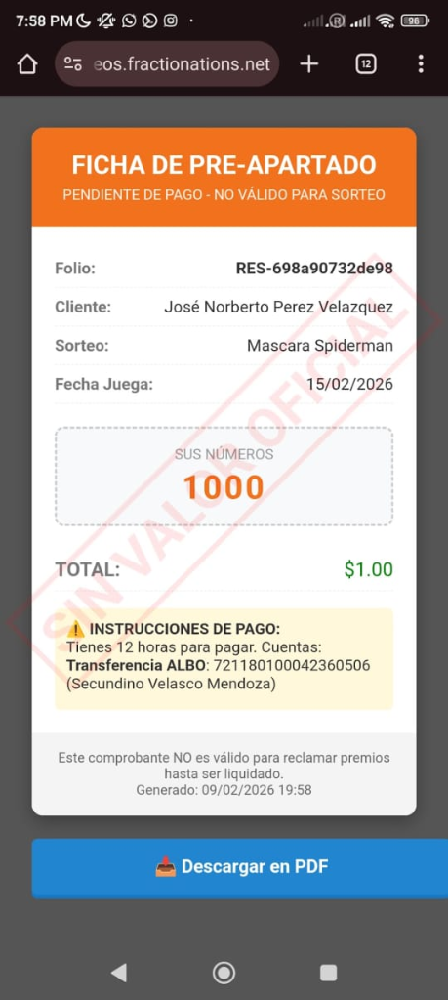
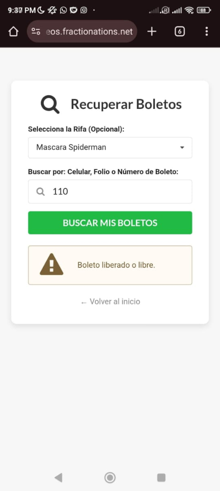

# 🎟️ Plataforma Web de Sorteos y Rifas Automáticas

> Sistema web transaccional (E-commerce especializado) diseñado para la venta, gestión y validación de boletos para sorteos. Permite a los usuarios seleccionar sus números, generar reservas temporales y obtener comprobantes en PDF con medidas antifraude.

---

## 📸 Flujo del Cliente (Mobile First)

| Confirmación de Reserva | Generación de Ticket en PDF | Recuperación de Boletos |
|---|---|---|
|  |  |  |

---

## ✨ Características Principales

### 🛒 Motor de Reservas y Expiración
- **Selección Múltiple:** Los usuarios pueden apartar múltiples números simultáneamente.
- **Temporizador de Pago:** El sistema otorga un lapso (ej. 12 horas) para liquidar la transferencia bancaria. Si el sistema no detecta la validación del administrador en ese tiempo, **los boletos se liberan automáticamente** al público.

### 📄 Generación Dinámica de Comprobantes (PDF)
- **Fichas de Pre-apartado:** Al reservar, el servidor compila en tiempo real un documento PDF descargable con los datos del folio, sorteo, costo y números elegidos.
- **Marca de Agua Anti-Fraude:** Los boletos no pagados incluyen una marca de agua inyectada en el PDF ("SIN VALOR OFICIAL") para evitar que usuarios reclamen premios sin haber liquidado.

### 🔍 Módulo de Seguimiento
- **Buscador Integrado:** Los clientes pueden rastrear el estado de su reserva ingresando su número de teléfono o folio asignado.
- **Integración con WhatsApp:** Botón de acción rápida que redirige al usuario a la API de WhatsApp para notificar su pago directamente al administrador, adjuntando la información de su orden.

---

## 🛠️ Tecnologías

| Herramienta | Uso en la Arquitectura |
|---|---|
| **PHP + Composer** | Lógica de enrutamiento y procesamiento de compras. |
| **Generador PDF** | Compilación de código HTML a Documentos PDF transaccionales. |
| **MySQL** | Prevención de doble venta (bloqueo de registros) e integridad de folios. |
| **WhatsApp API** | Creación de URLs dinámicas (`wa.me`) precargadas con los datos del pedido. |

---

## 📌 Estado del Proyecto

---

## 🔗 Volver al Portafolio

[← Regresar al índice principal](../README.md)
