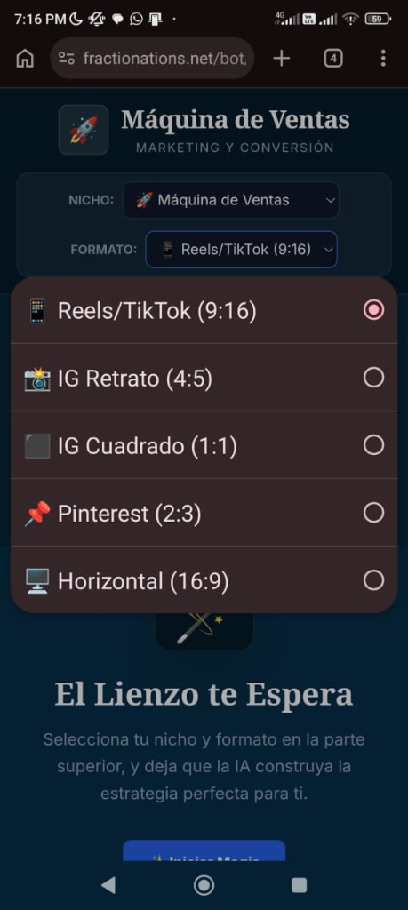

# 🚀 Máquina de Ventas IA — Content Creator SaaS

> Plataforma B2B (SaaS Privado) impulsada por Inteligencia Artificial diseñada para automatizar la creación de contenido de marketing digital. Genera desde la estrategia y ganchos virales, hasta el diseño visual de los carruseles listos para publicarse.

---

## 🛠️ Panel de Control y Formatos

| Módulos de Inteligencia Artificial | Selector de Formato (Redes Sociales) |
|---|---|
|  |  |

## 🎨 Creador Visual y Estrategia

| Editor Dinámico de Carruseles | Laboratorio de Ganchos (Copywriting) |
|---|---|
|  |  |

## 📅 Planeación y Gestión

---

## ✨ Características Principales

### 🧠 Copywriting Asistido por IA (Prompt Engineering)
- **Lab. de Ganchos Virales:** Utiliza LLMs estructurados para escupir "hooks" altamente convertibles basados en nichos específicos (Ej. Pizzerías, Agencias, etc.).
- **Plan Estratégico:** Genera un calendario de contenido semanal detallado, dividiendo las tareas en lunes a domingo con métricas clave y objetivos por publicación.
- **Guiones de Video:** Crea scripts completos formateados para TikToks o Reels.

### 🖼️ Editor Visual (Canvas Render)
- **Generador de Carruseles:** Plantillas dinámicas de texto sobre imágenes donde la IA redacta el contenido (Slide 1 de 5...) y el usuario puede cambiar el fondo y descargarlo directamente.
- **Responsivo Multi-Formato:** Lienzos autoadaptables a los estándares de la industria: *Reels (9:16), IG Retrato (4:5), IG Cuadrado (1:1), Pinterest (2:3)* y *Horizontal (16:9)*.

### 💰 Sistema de Créditos y Monetización
- Control de usuarios (Suscripción PRO) con billetera de créditos lógicos para limitar o habilitar la cantidad de peticiones de inteligencia artificial.

---

## 💻 Tecnologías Aplicadas

| Módulo | Función Técnica |
|---|---|
| **Integración LLM** | Uso de APIs de Inteligencia Artificial Generativa configuradas con "System Prompts" estrictos para devolver formatos JSON/Texto para marketing. |
| **DOM a Imagen** | Compilación de código HTML y CSS en imágenes PNG/JPG en tiempo real para la exportación de los carruseles. |
| **Arquitectura SaaS** | Sistema centralizado dentro del ecosistema Fraccionations para aislar clientes por nicho. |

---

## 📌 Estado del Proyecto

---

## 🔗 Volver al Portafolio

[← Regresar al índice principal](../README.md)
