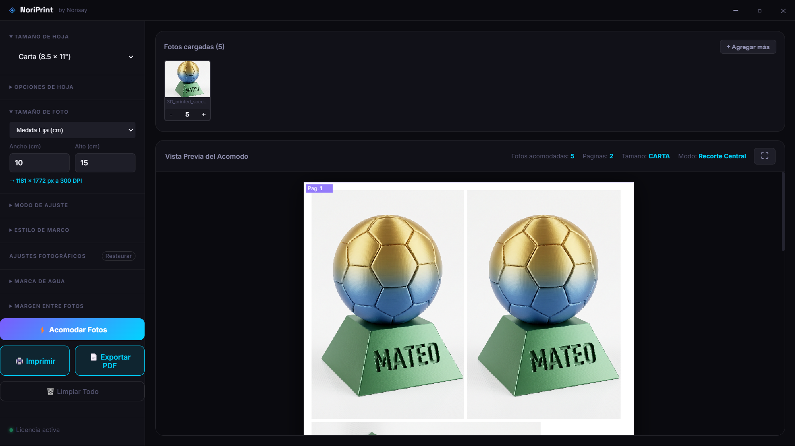
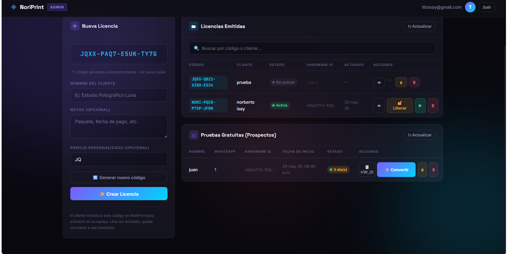
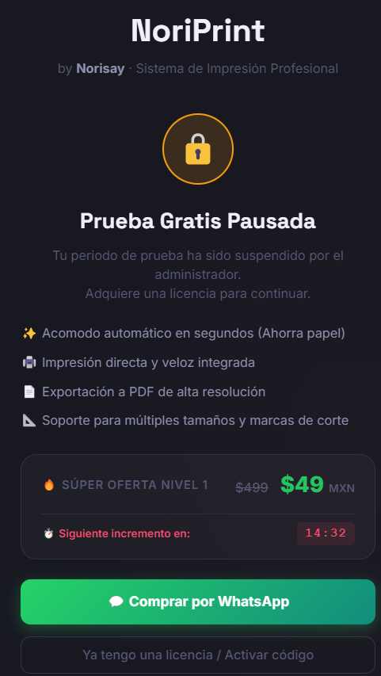

# 🖨️ NoriPrint — Sistema de Acomodo de Fotos para Impresión

> Aplicación de escritorio portable que organiza automáticamente fotografías en hojas para impresión de alta calidad a **300 DPI**, con sistema de licencias integrado.

---

## 📸 Vistas del Sistema

| App Principal (Acomodo 300 DPI) | Panel de Admin (Licencias) |
|---|---|
|  |  |

| Pantalla de Licencia |
|---|
|  |

---

## ✨ Características Principales

- 📐 **Algoritmo 2D de bin-packing** para acomodar fotos automáticamente sin desperdiciar espacio
- 🖼️ **3 modos de ajuste**: Cover, Contain y Proporcional
- 📄 **Exportación a PDF** a 300 DPI lista para imprimir
- 🔑 **Sistema de licencias** con periodo de prueba de 3 días gratis
- 🔒 **Vinculación por hardware** (ID de máquina único por licencia)
- ☁️ **Verificación online + modo offline** con caché local
- 🌙 **Diseño oscuro** (glassmorphism)
- 🗂️ **Panel de administración** para gestionar clientes y licencias

---

## 🛠️ Tecnologías


| Tecnología | Uso |
|---|---|
| **Electron** | App de escritorio portable (.exe) |
| **Firebase Firestore** | Base de datos de licencias en la nube |
| **Canvas API** | Procesamiento de imágenes a 300 DPI |
| **jsPDF** | Exportación a PDF profesional |
| **node-machine-id** | Vinculación de licencia al hardware |

---

## 🔑 Sistema de Licencias

```
Usuario nuevo → Prueba 3 días (automática)
                     ↓
              Compra licencia
                     ↓
         Admin genera código en panel
                     ↓
       Usuario activa con código → Uso permanente
```

---

## 📁 Estructura del Proyecto

```
NoriPrint/
├── src/
│   ├── main.js              # Proceso principal Electron
│   ├── preload.js           # Bridge IPC seguro
│   └── renderer/
│       ├── index.html       # Interfaz principal
│       ├── styles.css       # Diseño oscuro / glassmorphism
│       ├── app.js           # Controlador principal
│       ├── firebase-service.js  # Validación de licencias
│       ├── image-processor.js   # Cover / Contain / Proporcional
│       ├── bin-packer.js        # Algoritmo 2D de acomodo
│       └── pdf-exporter.js      # Exportación con jsPDF
├── admin-nory.html          # Panel de administración
└── package.json
```

---

## 📌 Estado del Proyecto


---

## 🔗 Volver al Portafolio

[← Regresar al índice principal](../README.md)
