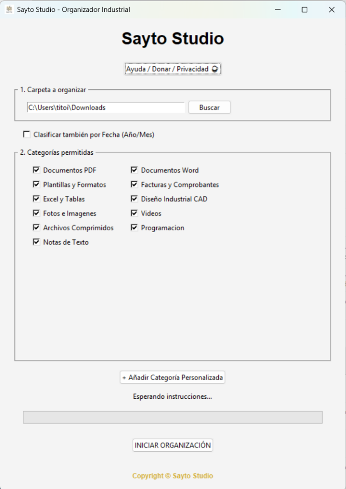
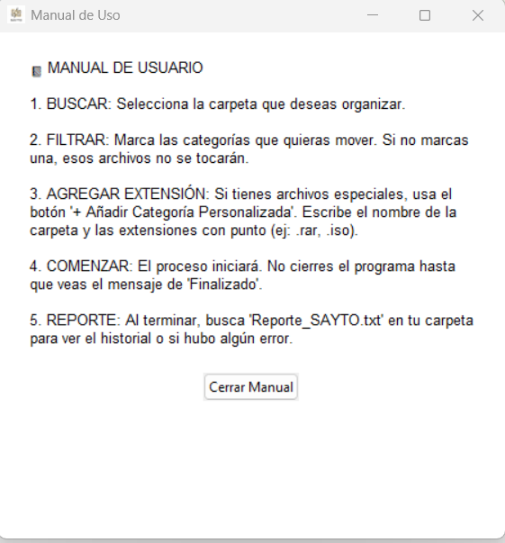
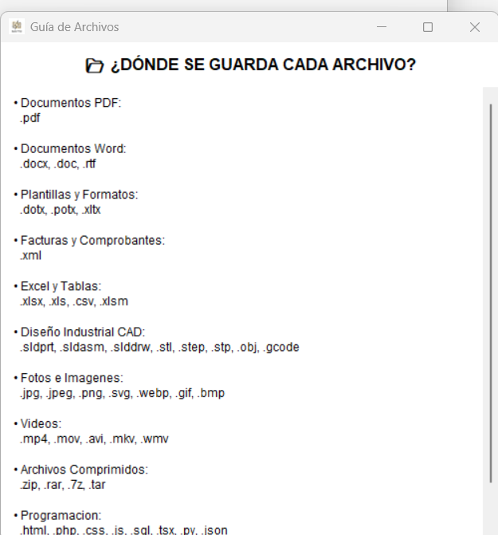
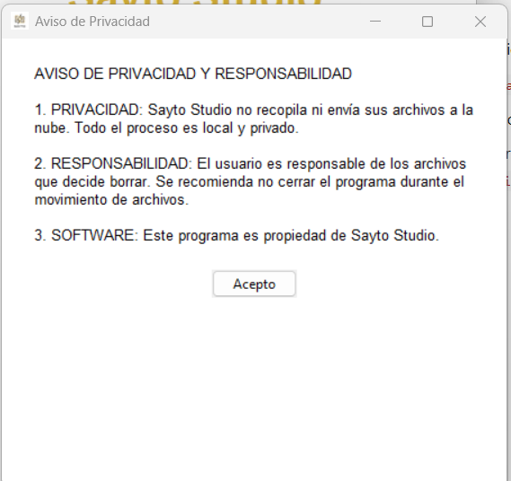

# 📦 SAYTO Studio — Organizador Industrial de Archivos

> Aplicación de escritorio portable (`.exe`) que organiza automáticamente carpetas clasificando archivos por tipo, con soporte especial para archivos de **Diseño Industrial CAD**. Procesamiento 100% local — ningún archivo sale del equipo.

---

## 📸 Vistas del Sistema

| Interfaz Principal | Manual de Uso |
|---|---|
|  |  |

| Guía de Archivos | Aviso de Privacidad |
|---|---|
|  |  |

---

## ✨ Características

- 📁 **Selección de carpeta** a organizar con explorador de archivos
- ☑️ **Categorías activables/desactivables** — solo se mueven los tipos que el usuario marque
- 📅 **Clasificación por fecha** opcional (subcarpetas por Año/Mes)
- ➕ **Categorías personalizadas** — agrega cualquier extensión propia
- 📝 **Reporte automático** `Reporte_SAYTO.txt` con historial y errores
- 🔒 **100% local y privado** — ningún archivo se envía a la nube
- 🖥️ App portable `.exe` — **sin instalación**

---

## 🗂️ Categorías Soportadas

| Categoría | Extensiones |
|---|---|
| 📄 Documentos PDF | `.pdf` |
| 📝 Documentos Word | `.docx`, `.doc`, `.rtf` |
| 📋 Plantillas y Formatos | `.dotx`, `.potx`, `.xltx` |
| 🧾 Facturas y Comprobantes | `.xml` |
| 📊 Excel y Tablas | `.xlsx`, `.xls`, `.csv`, `.xlsm` |
| 🔧 **Diseño Industrial CAD** | `.sldprt`, `.sldasm`, `.slddrw`, `.stl`, `.step`, `.stp`, `.obj`, `.gcode` |
| 🖼️ Fotos e Imágenes | `.jpg`, `.jpeg`, `.png`, `.svg`, `.webp`, `.gif`, `.bmp` |
| 🎬 Videos | `.mp4`, `.mov`, `.avi`, `.mkv`, `.wmv` |
| 🗜️ Archivos Comprimidos | `.zip`, `.rar`, `.7z`, `.tar` |
| 💻 Programación | `.html`, `.php`, `.css`, `.js`, `.sql`, `.tsx`, `.py`, `.json` |
| ➕ Personalizada | Cualquier extensión definida por el usuario |

---

## 🔄 Flujo de Uso

```
1. BUSCAR    → Selecciona la carpeta a organizar
2. FILTRAR   → Marca solo las categorías que quieres mover
3. AGREGAR   → (Opcional) Añade categorías con extensiones propias
4. COMENZAR  → Inicia la organización
5. REPORTE   → Revisa Reporte_SAYTO.txt con el historial
```

---

## 🛠️ Tecnologías


| Herramienta | Uso |
|---|---|
| **Python** | Lógica de clasificación y movimiento de archivos |
| **tkinter** | Interfaz gráfica nativa de Windows |
| **PyInstaller** | Compilación a `.exe` portable |

---

## 📌 Estado del Proyecto


---

## 🔗 Volver al Portafolio

[← Regresar al índice principal](../README.md)
