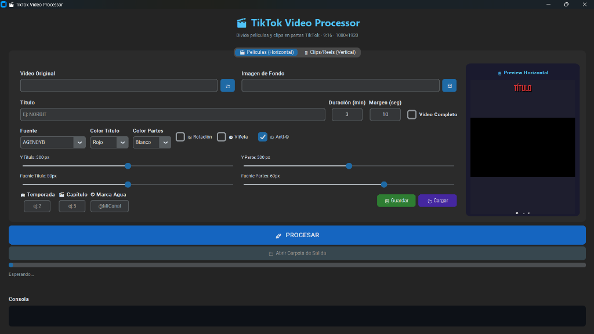

# 🎬 TikTok Video Processor — Procesador de Videos para TikTok

> Aplicación de escritorio portable que divide automáticamente películas y clips en partes optimizadas para TikTok (**9:16 · 1080×1920**), con superposición de texto, marca de agua, efectos visuales y sistema de licencias.

---

## 📸 Vistas del Sistema

| Interfaz Principal |
|---|
|  |

---

## ✨ Características

### 🎬 Dos modos de procesamiento
- **📽️ Películas (Horizontal)** — Divide una película larga en partes tipo serie
- **📱 Clips/Reels (Vertical)** — Procesa clips cortos para formato Reels/TikTok

### 🎨 Personalización visual
- 🔤 **Título personalizable** con fuente, color y posición ajustable
- 🎨 **Color del título** y **color de número de parte** independientes
- 📏 **Tamaño de fuente** con sliders deslizables
- 🌀 **Rotación** del texto opcional
- 🌑 **Viñeta** (efecto de oscurecimiento en bordes)
- 🖼️ **Imagen de fondo** personalizable
- 🚫 **Anti-IA** — efecto para dificultar detección automática

### 🗂️ Organización automática
- 📁 Carpeta de salida automática: `NombreTitulo_TikTok/`
- 📄 Archivos numerados: `Titulo_Parte_001.mp4`, `Titulo_Parte_002.mp4`...
- ⏱️ Duración por parte configurable (minutos)
- ⏸️ Margen entre partes configurable (segundos)
- 📺 Modo **Video Completo** sin cortes

### 📺 Metadata de serie
- 🎞️ Número de **Temporada**
- 📖 Número de **Capítulo**
- 💧 **Marca de Agua** con handle (`@MiCanal`)

### 🔑 Sistema de Licencias
- Panel de administración de licencias incluido (`admin_licencias.html`)
- Compilación con ofuscación de código (PyArmor)

---

## 🛠️ Tecnologías


| Herramienta | Uso |
|---|---|
| **Python** | Lógica principal y UI |
| **customtkinter** | Interfaz gráfica moderna (tema oscuro) |
| **FFmpeg + FFprobe** | Procesamiento, corte y renderizado de video |
| **PyInstaller** | Compilación a `.exe` portable |
| **PyArmor** | Ofuscación del código fuente |

---

## 📁 Estructura del Proyecto

```
proyecto-videos/
├── tiktok_processor.py      ← Script principal
├── tiktok_processor.spec    ← Configuración de compilación
├── admin_licencias.html     ← Panel de administración
├── admin_licencias.py       ← Backend de licencias
├── ffmpeg.exe               ← Motor de video (incluido)
├── ffprobe.exe              ← Análisis de video (incluido)
├── fuentes/                 ← Fuentes personalizadas
├── compilar_seguro.bat      ← Build con ofuscación
└── dist/
    └── TikTokProcessor.exe  ← Ejecutable final
```

---

## 📌 Estado del Proyecto


---

## 🔗 Volver al Portafolio

[← Regresar al índice principal](../README.md)
