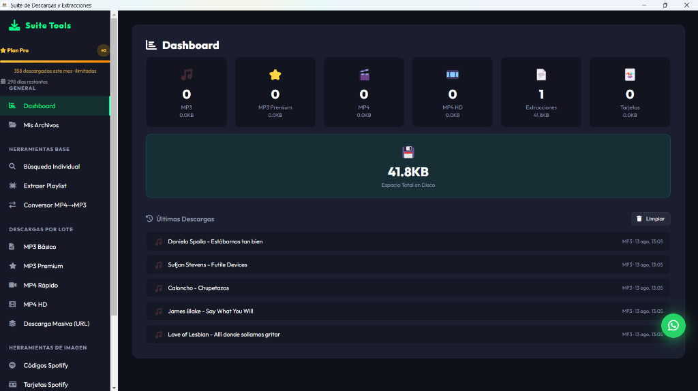
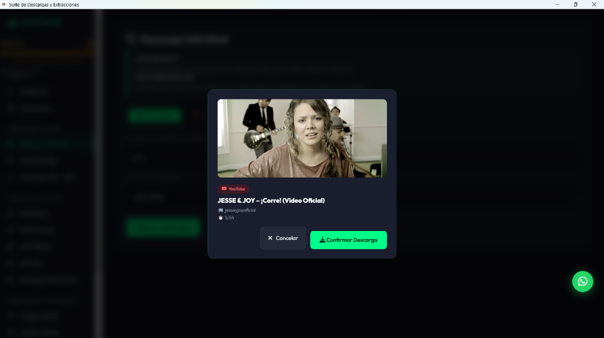
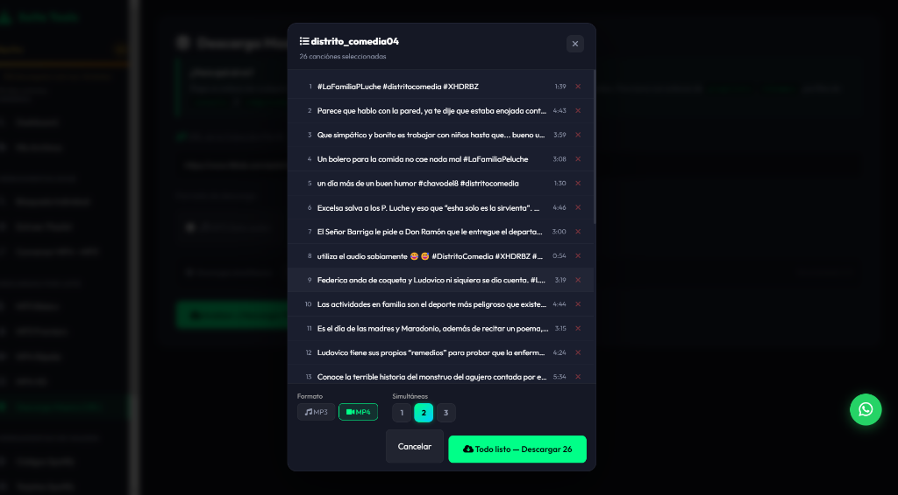
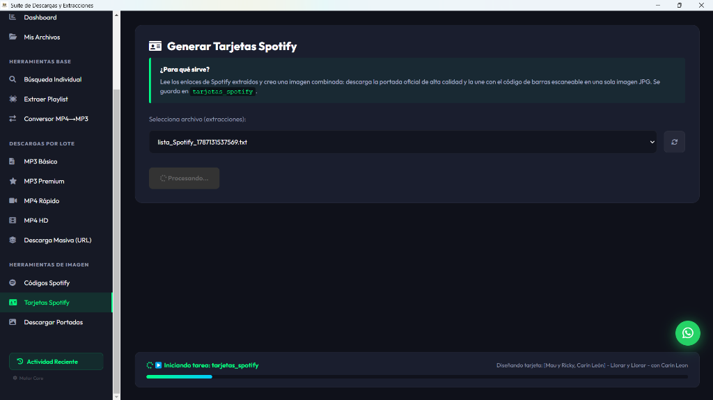
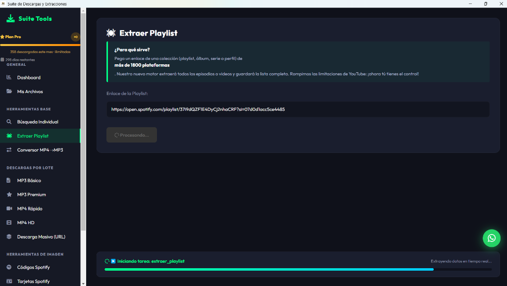
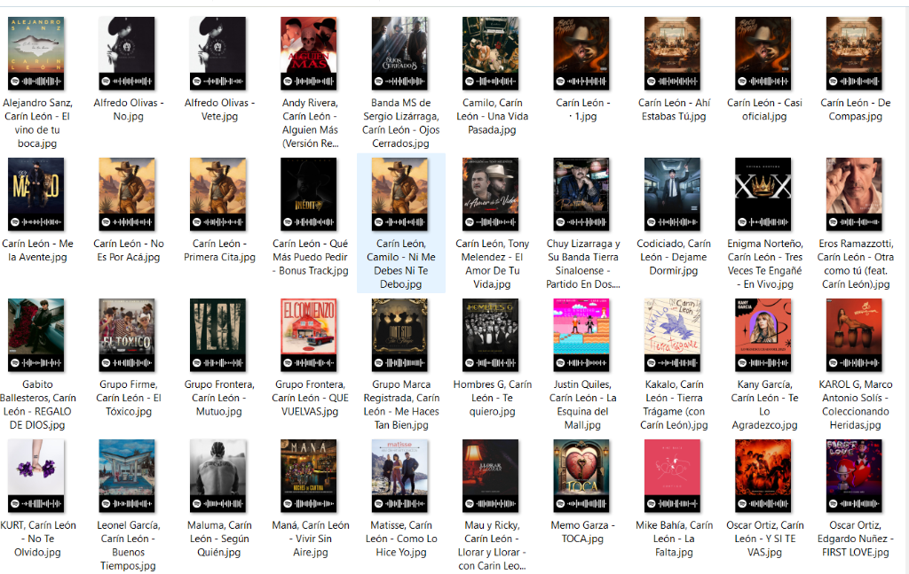

# 🎵 Suite Tools — Suite de Descargas y Extracciones Multimedia

> Aplicación de escritorio con **Plan Pro** que permite descargar audio y video desde **más de 1800 plataformas**, extraer playlists completas, convertir formatos y generar tarjetas visuales de Spotify. Sistema de suscripción con límite de descargas mensuales.

---

## 📸 Vistas del Sistema

| Dashboard Principal |
|---|
|  |

| Confirmación de Descarga | Extraer Playlist (26 videos) |
|---|---|
|  |  |

| Generar Tarjetas Spotify | Extraer Playlist (1800+ plataformas) |
|---|---|
|  |  |

| Resultado — Tarjetas Spotify generadas |
|---|
|  |

---

## ✨ Características

### 📊 Dashboard
- Estadísticas en tiempo real: MP3, MP3 Premium, MP4, MP4 HD, Extracciones, Tarjetas
- Historial de **últimas descargas** con fecha y hora
- Espacio total en disco usado
- Sistema de **Plan Pro** con descargas ilimitadas mensuales

### 🔧 Herramientas Base
- 🔍 **Búsqueda Individual** — busca y descarga canciones/videos por nombre
- 📋 **Extraer Playlist** — extrae listas completas de **más de 1800 plataformas** (Spotify, YouTube, TikTok y más)
- 🔄 **Conversor MP4 → MP3** — convierte videos a audio

### 📥 Descargas por Lote
| Modo | Calidad |
|---|---|
| MP3 Básico | Audio estándar |
| ⭐ MP3 Premium | Alta calidad de audio |
| MP4 Rápido | Video rápido |
| 🎬 MP4 HD | Video alta definición |
| 🌐 Descarga Masiva (URL) | Múltiples URLs a la vez |

### ⚡ Descargas Simultáneas
- Procesa **1, 2 o 3 descargas al mismo tiempo** configurables por el usuario

### 🎨 Herramientas de Imagen
- 🎵 **Códigos Spotify** — genera códigos escaneables de canciones
- 🃏 **Tarjetas Spotify** — crea imagen combinada (portada + código de barras escaneable)
- 🖼️ **Descargar Portadas** — descarga las carátulas de alta calidad

### 🔑 Sistema de Licencias
- Plan Pro con contador de descargas mensuales
- Días restantes de suscripción visible en el panel
- Soporte vía WhatsApp integrado en la app

---

## 🛠️ Tecnologías


| Herramienta | Uso |
|---|---|
| **Electron** | App de escritorio multiplataforma |
| **Node.js** | Backend y lógica de descargas |
| **yt-dlp** | Motor de descarga (1800+ plataformas) |
| **FFmpeg** | Conversión de formatos (MP4→MP3) |
| **HTML/CSS** | Interfaz oscura tipo dashboard |

---

## 📁 Estructura

```
buscador-suite/
├── main.js              ← Proceso principal Electron
├── renderer/            ← Interfaz (HTML/CSS/JS)
├── src/
│   ├── downloader.js    ← Motor de descarga
│   ├── converter.js     ← Conversor MP4→MP3
│   ├── spotify.js       ← Tarjetas y códigos Spotify
│   └── license.js       ← Sistema de licencias
├── build_secure.js      ← Build con ofuscación
└── dist/                ← Ejecutable final
```

---

## 📌 Estado del Proyecto


-gold?style=flat-square)


---

## 🔗 Volver al Portafolio

[← Regresar al índice principal](../README.md)
