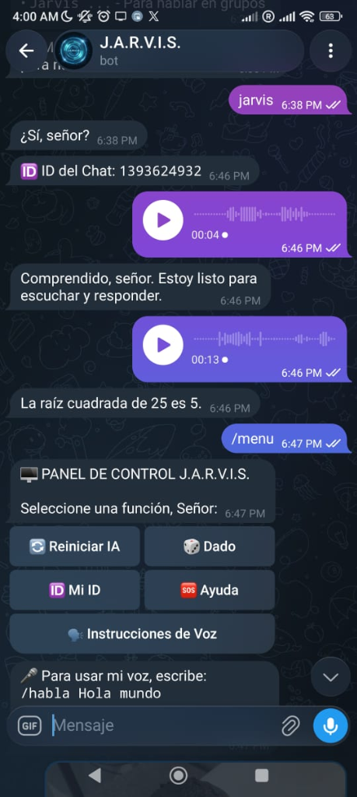
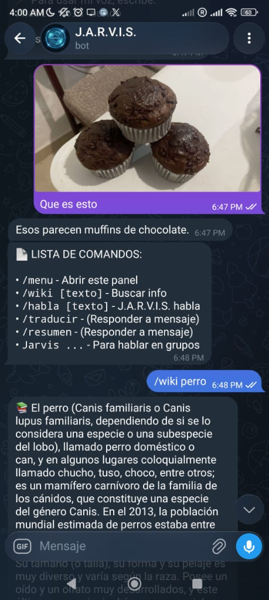
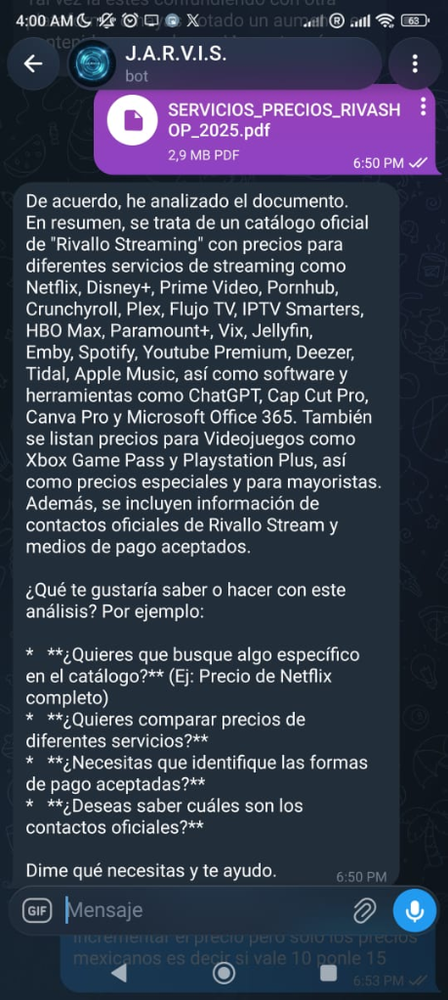

# 🤖 J.A.R.V.I.S. — Bot de Telegram con IA

> Bot de Telegram con personalidad de **J.A.R.V.I.S.** (Just A Rather Very Intelligent System) que integra **Google Gemini 2.0** para conversación, análisis de imágenes, transcripción de voz, análisis de PDFs, búsqueda en Wikipedia, traducción y más. Funciona en chats privados y **grupos**.

---

## 📸 Vistas del Sistema

| Panel de Control + Voz | Visión IA + Wiki | Análisis de PDF |
|---|---|---|
|  |  |  |

---

## ✨ Características

### 🧠 Conversación con IA
- Responde a cualquier mensaje con **Google Gemini 2.0 Flash**
- Activación en grupos con la palabra clave `Jarvis ...`
- Personalidad de asistente fiel: *"¿Sí, señor?"*

### 🎙️ Procesamiento de Voz
- Acepta **notas de voz** de Telegram
- Las transcribe y responde con IA
- Comando `/habla [texto]` — el bot responde en audio

### 👁️ Visión Artificial
- Analiza **fotos** enviadas al chat
- Describe el contenido de la imagen con precisión
- Ejemplo: foto de muffins → *"Esos parecen muffins de chocolate"*

### 📄 Análisis de PDFs
- El usuario envía un PDF y el bot lo analiza completo
- Genera **resumen**, extrae información clave y responde preguntas sobre el documento
- Ejemplo: catálogo de precios de streaming → resumen detallado con servicios y precios

### 📚 Comandos Disponibles

| Comando | Función |
|---|---|
| `/menu` | Abre el panel de control con botones |
| `/wiki [texto]` | Busca información en Wikipedia |
| `/habla [texto]` | J.A.R.V.I.S. responde en audio |
| `/traducir` | Traduce el mensaje respondido |
| `/resumen` | Resume el mensaje respondido |
| `/mi_id` | Muestra el ID del chat |
| `Jarvis ...` | Para usar en grupos |

### 🎲 Mini-juegos
- **Dado** — tira un dado desde el panel

---

## 🛠️ Tecnologías


| Librería | Uso |
|---|---|
| **python-telegram-bot** | Framework del bot |
| **google-generativeai** | Google Gemini 2.0 Flash (chat, visión, PDFs) |
| **Flask** | Servidor keep-alive para deploy en la nube |

---

## 📁 Estructura

```
MiBotTelegram/
├── bot.py               ← Bot básico (local)
├── LA NUBE/
│   ├── bot.py           ← Bot completo (deploy en la nube)
│   └── requirements.txt
└── USERBOT SPAM/        ← Módulo de userbot separado
    └── userbot.py
```

---

## 📌 Estado del Proyecto


---

## 🔗 Volver al Portafolio

[← Regresar al índice principal](../README.md)
