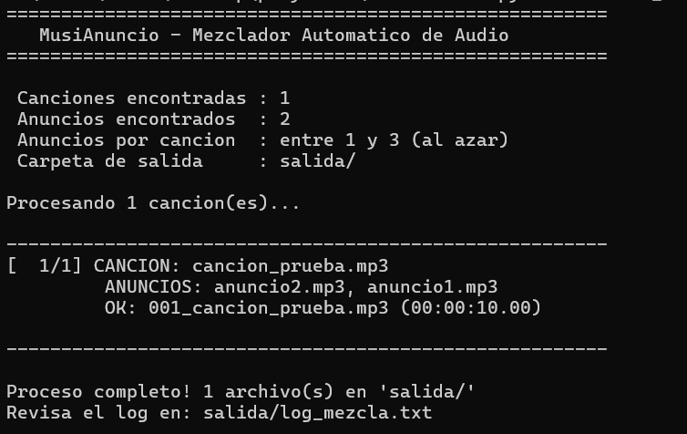

# 🎵 MusiAnuncio — Mezclador Automático de Audio con Anuncios

> Script que toma una lista de canciones e intercala anuncios publicitarios automáticamente entre cada pista. Genera los archivos de audio finales listos para transmitir.

---

## 📸 Capturas

| Ejecución en consola |
|---|
|  |

```
MusiAnuncio – Mezclador Automatico de Audio

 Canciones encontradas : 1
 Anuncios encontrados  : 2
 Anuncios por cancion  : entre 1 y 3 (al azar)
 Carpeta de salida     : salida/

[ 1/1] CANCION: cancion_prueba.mp3
        ANUNCIOS: anuncio2.mp3, anuncio1.mp3
        OK: 001_cancion_prueba.mp3 (00:00:10.00)

Proceso completo! 1 archivo(s) en 'salida/'
Revisa el log en: salida/log_mezcla.txt
```

---

## ✨ Características

- 🎶 Procesa **cualquier cantidad** de canciones automáticamente
- 📢 Inserta **1 a 3 anuncios al azar** entre cada canción (configurable)
- 🔀 Selección **aleatoria** de anuncios para variedad
- 🔇 Silencio configurable entre pistas (ms)
- 📝 Genera un `log_mezcla.txt` con el registro exacto de qué anuncios se pusieron
- 🎵 Soporta MP3, WAV, OGG, FLAC, AAC, M4A
- 📁 Salida numerada y ordenada automáticamente

---

## 🛠️ Tecnologías


| Herramienta | Uso |
|---|---|
| **Python** | Script principal de mezcla |
| **FFmpeg** | Procesamiento y concatenación de audio |
| **pydub** | Manipulación de segmentos de audio |

---

## 📁 Estructura

```
musianuncio/
├── canciones/          ← Pon aquí tus canciones (MP3, WAV, etc.)
├── anuncios/           ← Pon aquí tus anuncios (hasta 5 o más)
├── salida/             ← Archivos finales generados automáticamente
│   └── log_mezcla.txt  ← Registro de mezclas
├── mezclar_audio.py    ← Script principal
└── requirements.txt
```

---

## ⚙️ Configuración

```python
MIN_ANUNCIOS_POR_CANCION = 1    # mínimo de anuncios por canción
MAX_ANUNCIOS_POR_CANCION = 3    # máximo de anuncios por canción
SILENCIO_ENTRE_PISTAS_MS = 500  # silencio entre canción y anuncio (ms)
```

---

## 📌 Estado del Proyecto


---

## 🔗 Volver al Portafolio

[← Regresar al índice principal](../README.md)
