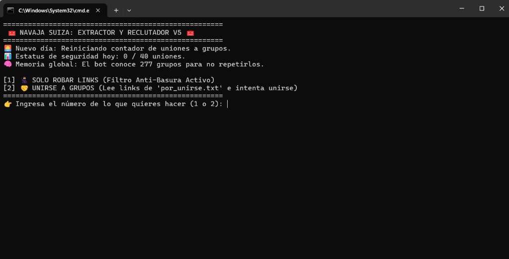
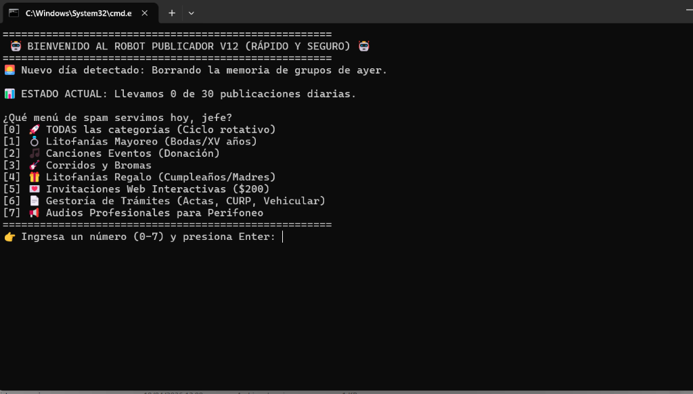

# 🤖 Suite Robot Publicador — Automatización de Marketing Digital

> Suite de herramientas de automatización para **publicidad masiva en WhatsApp** y **extracción de leads desde Google Maps**. Combina Puppeteer Stealth, Gemini AI y Node.js para operar sin ser detectado. Incluye interfaz Electron y múltiples módulos especializados.

---

## 📸 Vistas del Sistema

| Navaja Suiza — Extractor & Reclutador V5 | Robot Publicador V12 — Menú de Categorías |
|---|---|
|  |  |

---

## 🛠️ Módulos del Sistema

### 📢 Robot Publicador V12
Publica mensajes automáticamente en grupos de WhatsApp por categoría de negocio:

| # | Categoría |
|---|---|
| 0 | 🚀 Todas las categorías (Ciclo rotativo) |
| 1 | 💍 Litofanías Mayoreo (Bodas/XV años) |
| 2 | 🎵 Canciones para Eventos (Donación) |
| 3 | 🎸 Corridos y Bromas |
| 4 | 🎁 Litofanías Regalo (Cumpleaños/Madres) |
| 5 | 💻 Invitaciones Web Interactivas ($200) |
| 6 | 📋 Gestoría de Trámites (Actas, CURP, Vehicular) |
| 7 | 📻 Audios Profesionales para Perifoneo |

- Límite de **30 publicaciones diarias** con reinicio automático
- Memoria de grupos visitados (evita repetición)

### 🔪 Navaja Suiza — Extractor & Reclutador V5
Herramienta doble para gestión de grupos:
- **Modo 1 — Solo Robar Links**: extrae invitaciones de grupos con **Filtro Anti-Basura**
- **Modo 2 — Unirse a Grupos**: lee `por_unirse.txt` y se une automáticamente
- Memoria global de **277+ grupos conocidos** para no repetir
- Límite de seguridad: **40 uniones por día**

### 🗺️ Sabueso Maps — Extractor de Leads desde Google Maps
Scraper especializado en Google Maps para extracción de contactos de negocios:
- Búsqueda por **Código Postal** y categoría de negocio
- Extrae: nombre, teléfono, dirección, horarios
- Guarda leads en Excel (`exceljs`)
- Proxies validados para evitar bloqueos
- Progreso guardado para reanudar búsquedas

---

## ✨ Características Comunes

- 🕵️ **Puppeteer Stealth** — opera sin ser detectado como bot
- 🧠 **Google Gemini AI** — análisis y generación de contenido
- 📊 **ExcelJS** — exportación de resultados
- 🖥️ **Interfaz Electron** — panel de control visual (`Lanzar_Suite_Pro.bat`)
- 💾 **Memoria persistente** — historial en JSON para no repetir acciones

---

## 🛠️ Tecnologías


| Librería | Uso |
|---|---|
| **puppeteer-core** | Automatización de Chrome |
| **puppeteer-extra-plugin-stealth** | Anti-detección de bot |
| **@google/generative-ai** | Gemini AI para contenido |
| **exceljs** | Exportación de leads a Excel |
| **electron** | Interfaz de escritorio |
| **dotenv** | Variables de entorno seguras |

---

## 📁 Estructura

```
RobotPublicador/
├── index.js                  ← Robot Publicador principal
├── buscador.js               ← Navaja Suiza (extractor/reclutador)
├── vendedor_mp.js            ← Publicador en Marketplace
├── main_electron.js          ← Interfaz Electron
├── maps/
│   └── sabueso_maps.js       ← Extractor de leads Google Maps
├── ui/                       ← Panel de control Electron
├── enlaces/                  ← Links de grupos extraídos
├── canciones_eventos/        ← Contenido por categoría
├── corridos/, mayoreo/...    ← Más categorías
└── Lanzar_Suite_Pro.bat      ← Lanzador principal
```

---

## 📌 Estado del Proyecto


---

## 🔗 Volver al Portafolio

[← Regresar al índice principal](../README.md)
