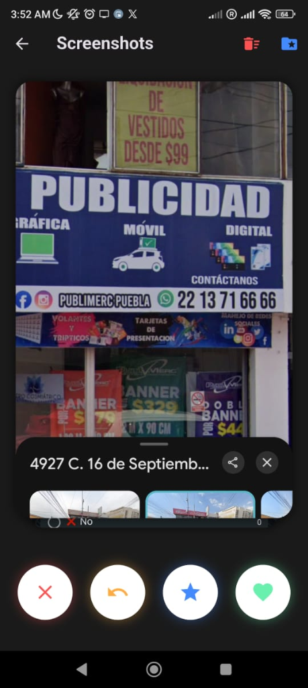

# 🪄 MagicFoto — Gestor Inteligente de Fotos

> App Android que organiza tu galería con **swipe tipo Tinder** — desliza para conservar o eliminar fotos — y detecta automáticamente **fotos duplicadas** para liberar espacio en tu dispositivo.

---

## 📸 Vistas del Sistema

| Tus Álbumes | Revisión con Swipe |
|---|---|
|  |  |

---

## ✨ Características

### 📂 Gestión de Álbumes
- Vista de todos los álbumes de la galería con miniaturas y contador de fotos
- Acceso rápido a cualquier álbum (WhatsApp, Screenshots, cámara, etc.)

### 👆 Revisión por Swipe
- **Desliza como Tinder** para revisar fotos una a una
- ❌ **No** — marca para eliminar
- ⭐ **Favorito** — guarda como destacada
- 💚 **Me gusta** — conservar
- ↩️ **Deshacer** — regresa a la foto anterior
- Muestra metadata: nombre del archivo, ubicación

### 🔍 Buscar Duplicados
- Detecta fotos duplicadas automáticamente
- Permite eliminarlas con un toque para liberar espacio

### 🗑️ Papelera
- Las fotos marcadas van a la papelera antes de borrarse definitivamente
- Confirmación antes de eliminar permanentemente

---

## 🛠️ Tecnologías

| Paquete | Uso |
|---|---|
| **photo_manager** ^3.9.0 | Acceso a la galería del dispositivo |
| **appinio_swiper** ^2.1.1 | Swipe tipo Tinder para fotos |
| **permission_handler** ^12.0.1 | Permisos de almacenamiento |
| **shared_preferences** ^2.5.5 | Guardar preferencias localmente |

---

## 📁 Pantallas

| Archivo | Pantalla |
|---|---|
| `home_screen.dart` | Vista de álbumes principal |
| `swipe_screen.dart` | Revisión por swipe |
| `duplicate_screen.dart` | Buscador de duplicados |
| `trash_screen.dart` | Papelera de fotos |
| `gallery_service.dart` | Servicio de acceso a galería |

---

## 📌 Estado del Proyecto

---

## 🔗 Volver al Portafolio

[← Regresar al índice principal](../README.md)
