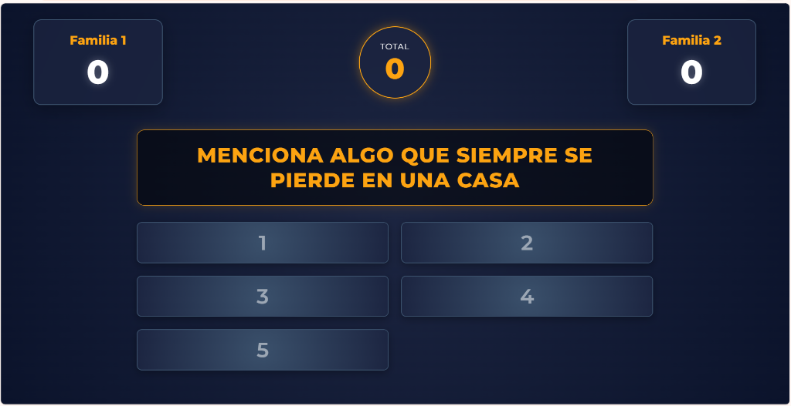
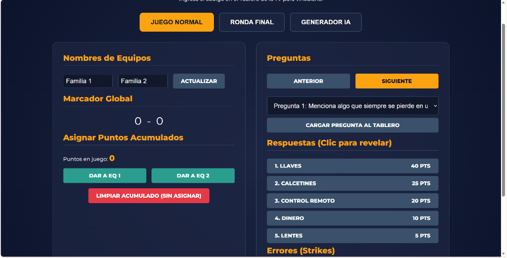

# 🗣️ La Gente Dice — Sistema Interactivo de Trivias

> Aplicación web en tiempo real diseñada para eventos en vivo, inspirada en el popular formato de televisión "Family Feud". Cuenta con un tablero principal para la audiencia y un panel de control privado para el presentador.

---

## 📸 Vistas del Sistema

| Tablero Principal (Audiencia) | Panel de Control (Presentador) |
|---|---|
|  |  |

---

## ✨ Características

### 🎮 Dinámica de Juego en Vivo
- **Sincronización en tiempo real:** Lo que el presentador presiona en su panel, aparece mágicamente en el tablero principal sin necesidad de recargar la página.
- **Manejo de equipos:** Nombres personalizables (Ej: Familia 1 vs Familia 2) y marcadores dinámicos.
- **Efectos clásicos:** Control de respuestas ocultas, puntos acumulados y botones de "Strikes" (Errores) para hacer la experiencia inmersiva.

### 🎛️ Panel de Control (Admin)
- **Carga de Preguntas:** Selector para cambiar de pregunta y enviarla al tablero.
- **Revelación individual:** Botones para revelar las respuestas una por una cuando los participantes aciertan (con sus respectivos puntos).
- **Asignación de puntos:** Permite dar los puntos acumulados en la ronda a cualquiera de los dos equipos.

### 🤖 Integración con IA
- **Generador IA:** Módulo integrado para crear nuevas preguntas y respuestas estilo encuestas al instante, asegurando horas infinitas de juego sin repetir contenido.

---

## 🛠️ Tecnologías


| Herramienta | Uso |
|---|---|
| **Vanilla JS** | Lógica de juego, animaciones y control de estado |
| **Firebase** | Base de datos en tiempo real para sincronizar las pantallas |
| **PWA** | Service Workers (`sw.js`) para poder instalarla como app de escritorio/móvil |

---

## 📁 Estructura

```
19-la-gente-dice/
├── index.html            ← Tablero visual para proyectar en TV
├── admin.html            ← Panel de control para el celular/laptop del Host
├── superadmin.html       ← Gestor global del juego
├── script.js             ← Lógica del tablero visual
├── admin.js              ← Lógica del panel de control
└── firebase-config.js    ← Conexión de base de datos en tiempo real
```

---

## 📌 Estado del Proyecto


---

## 🔗 Volver al Portafolio

[← Regresar al índice principal](../README.md)
