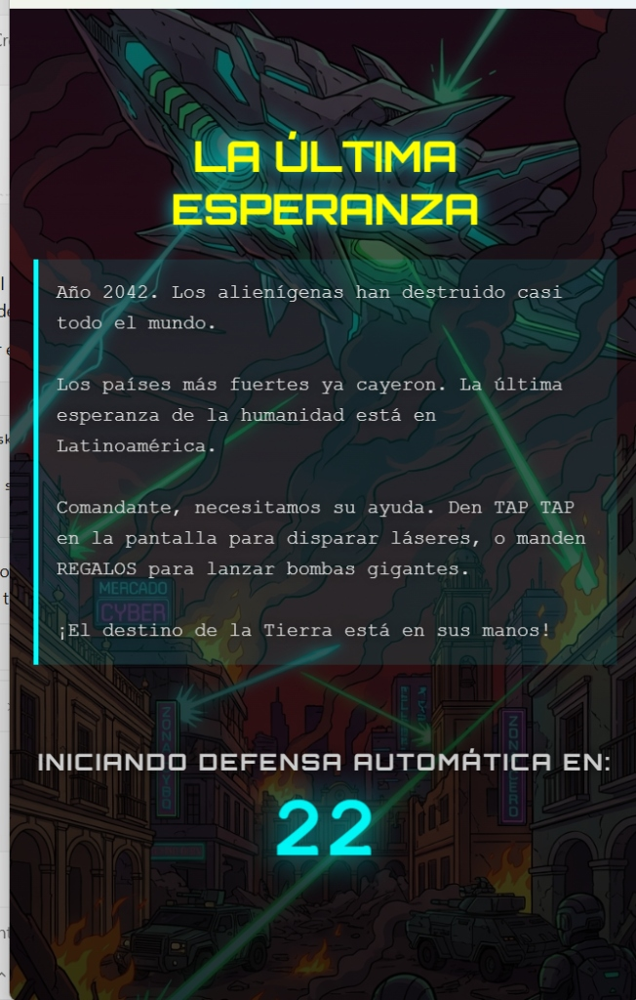
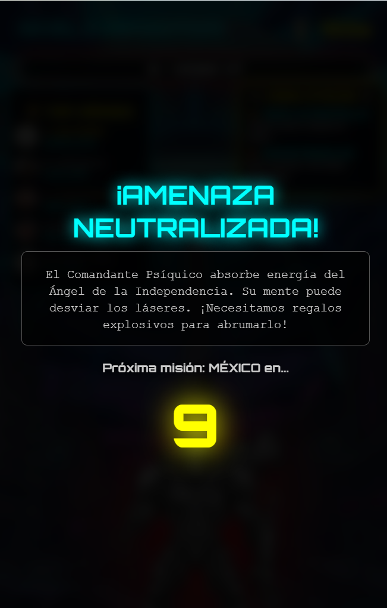
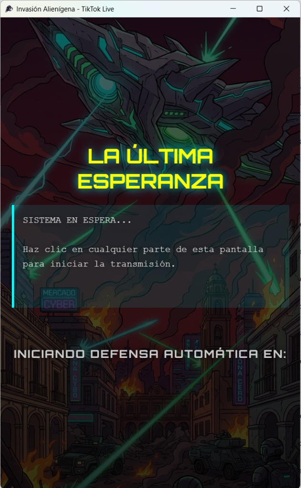
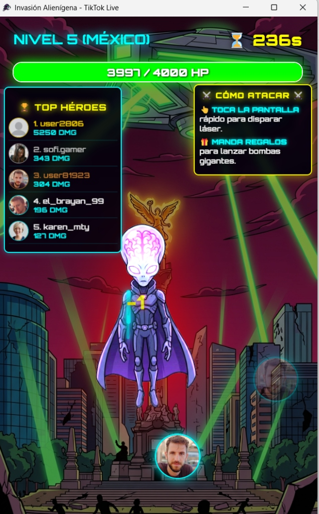

# 👽 Invasión Alienígena — Juego Interactivo para TikTok LIVE

> Videojuego cooperativo de escritorio desarrollado con **Electron**, diseñado para transmitirse en TikTok LIVE. Los espectadores interactúan en tiempo real (dando "Tap" y enviando "Regalos") para atacar a las naves alienígenas y defender Latinoamérica.

---

## 📸 Vistas del Juego

| Pantalla de Espera e Historia | Nivel 5: Defensa de México (Gameplay) |
|---|---|
|  |  |
| **Inicio de Transmisión** | **Victoria de Nivel** |
|  |  |

---

## ✨ Características

### 🎮 Jugabilidad en Tiempo Real (TikTok LIVE)
- **Ataques por Taps:** Los espectadores tocan la pantalla repetidamente para disparar rayos láser a la nave nodriza o al jefe alienígena.
- **Ataques por Regalos:** Al enviar regalos de TikTok, se lanzan "Bombas Gigantes" que infligen daño masivo.
- **Top Héroes:** Una tabla de clasificación dinámica ("Leaderboard") muestra en tiempo real la foto de perfil y el nombre de los 5 usuarios que más daño han causado (DMG).

### 📖 Narrativa y Niveles
- **Historia Inmersiva:** Ambientado en el año 2042. El resto del mundo ha caído y la última esperanza de la humanidad es Latinoamérica.
- **10 Niveles Progresivos:** Defensa de diferentes países. Cada nivel cuenta con su propio jefe, barra de HP (puntos de vida) y un temporizador.
- **Sistema de Audio Dinámico:** Incluye voces de la IA táctica "Atena", gritos del Comandante, música épica por nivel y efectos de sonido de explosiones y láseres.

### 💻 Rendimiento
- **Cliente Nativo:** Empaquetado como aplicación de escritorio `.exe` en Windows para garantizar fluidez durante la transmisión en vivo utilizando `electron-packager`.

---

## 🛠️ Tecnologías

| Herramienta | Uso |
|---|---|
| **Electron** | Motor principal para empaquetar el juego web como software de escritorio |
| **TikTok Live Connector** | Conexión WebSocket para leer Taps, Regalos y Perfiles en tiempo real |
| **HTML Canvas / JS** | Renderizado de animaciones, hitboxes, láseres y avatares de usuarios |

---

## 📌 Estado del Proyecto

---

## 🔗 Volver al Portafolio

[← Regresar al índice principal](../README.md)
