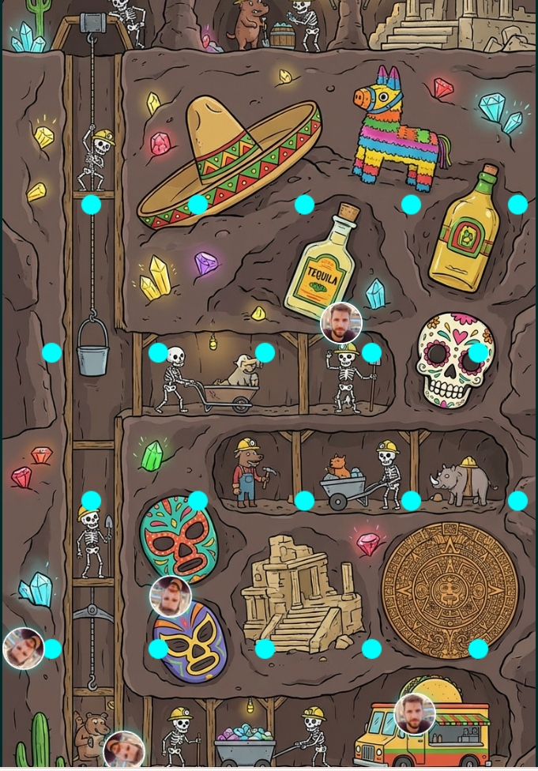
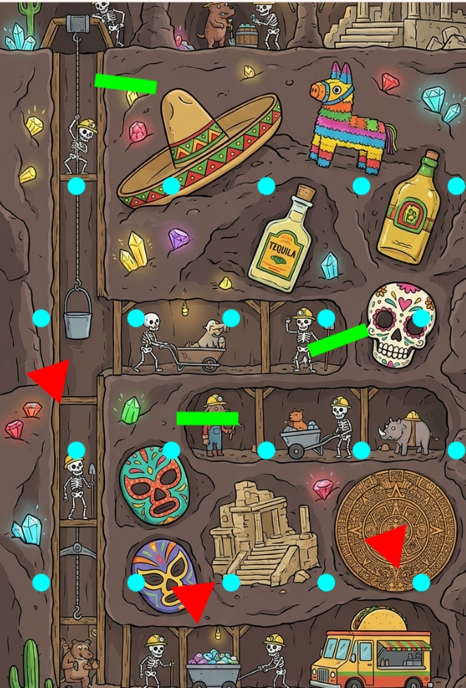

# 💀 Carrera de la Muerte — Prototipo Interactivo para TikTok LIVE

> Prototipo de videojuego interactivo de carreras por nodos, diseñado para transmisiones de TikTok LIVE. Los espectadores compiten entre sí avanzando a través de un laberinto subterráneo impulsados por sus interacciones en el chat.

---

## 📸 Vistas del Juego

| Progreso de Jugadores (Avatares) | Diseño de Nodos y Obstáculos |
|---|---|
|  |  |

---

## ✨ Características (Diseño del Prototipo)

### 🏎️ Mecánica de Carrera
- **Rutas por Nodos:** El mapa está compuesto por una red de nodos interconectados (puntos cian). Los avatares de los jugadores navegan automáticamente por esta ruta calculada.
- **Interacción en Vivo:** Diseñado para que la progresión de cada avatar dependa directamente de los "Taps" o "Regalos" que el usuario envíe durante la transmisión en TikTok.
- **Identidad Visual:** Los perfiles reales de los usuarios de TikTok se renderizan dinámicamente como los corredores del laberinto.

### 🚧 Niveles y Dificultad Dinámica
- **Múltiples Escenarios:** El sistema está planeado para cambiar el fondo y la temática de la pista al completar cada nivel.
- **Obstáculos y Potenciadores:** Inclusión de zonas de penalización (rojo) y zonas de impulso (verde) que añaden azar y emoción a la carrera.

### 🎨 Arte y Temática
- Diseño visual altamente detallado inspirado en la cultura mexicana: minas subterráneas, catrinas, calendarios aztecas, alebrijes y luchadores, optimizado en formato vertical (9:16) ideal para móviles.

---

## 🛠️ Tecnologías

| Herramienta | Uso |
|---|---|
| **Vanilla JS** | Lógica de movimiento, renderizado de nodos y sistema de avance |
| **Arquitectura Web** | Interfaz ligera lista para ser acoplada a la API de TikTok Live o integrada como overlay en OBS |

---

## 📌 Estado del Proyecto

-blue?style=flat-square)

---

## 🔗 Volver al Portafolio

[← Regresar al índice principal](../README.md)
