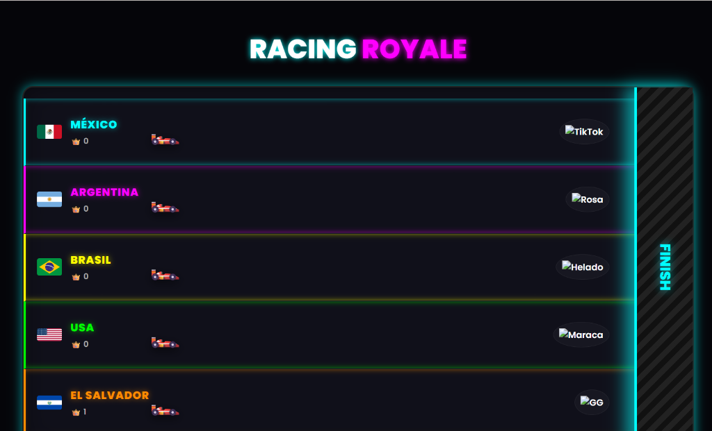
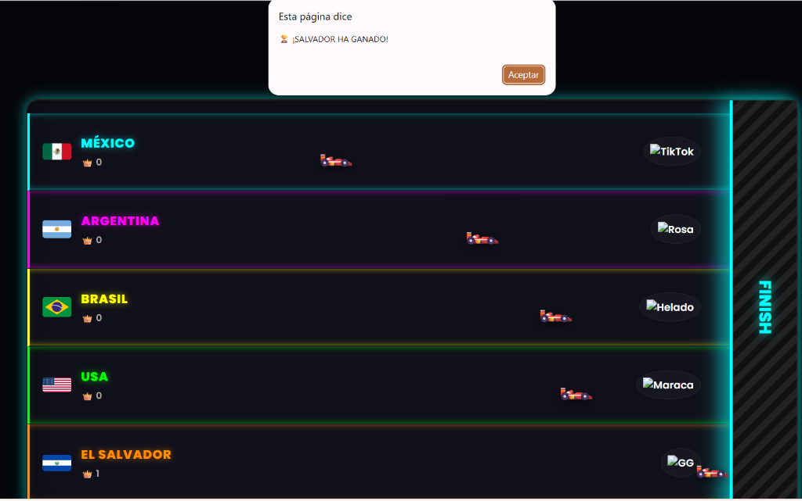

# 🏎️ Racing Royale — Carreras Interactivas para TikTok LIVE

> Uno de mis primeros desarrollos interactivos. Un minijuego web diseñado para integrarse como overlay en transmisiones de TikTok LIVE. Los espectadores "apoyan" a su país enviando regalos específicos que hacen avanzar a su vehículo en tiempo real.

---

## 📸 Vistas del Juego

| Pista de Carreras y Regalos | Pantalla de Victoria |
|---|---|
|  |  |

---

## ✨ Características

### 🏁 Dinámica de Carrera
- **Competencia entre Países:** Sistema de 5 carriles que representan distintos países (México, Argentina, Brasil, USA, El Salvador).
- **Mapeo de Regalos:** Cada país avanza únicamente cuando en el chat de TikTok se recibe un regalo virtual específico (Ej. Rosa, Helado, Maraca, GG, o la moneda TikTok).
- **Detección de Meta:** El sistema detecta automáticamente al primer coche en cruzar la línea de "FINISH" y despliega una alerta de victoria.

### 📊 Sistema de Puntuación
- **Rachas de Victorias:** Un contador de coronas bajo el nombre de cada país lleva el registro de cuántas carreras ha ganado cada equipo durante la transmisión continua.

### 💻 Diseño Optimizado para Streaming
- **Modo Overlay:** Interfaz con colores neón sobre fondo oscuro, ideal para ser capturada e incrustada limpiamente en softwares de transmisión (como OBS Studio) mediante "Browser Source".

---

## 🛠️ Tecnologías

| Herramienta | Uso |
|---|---|
| **Vanilla JS** | Motor de la carrera, sistema de avance por píxeles y detección de colisión con la meta |
| **CSS3** | Estilos neón tipo "Cyberpunk/Arcade" y animaciones fluidas de los vehículos |
| **Integración TikTok** | Preparado para recibir eventos de API a través de conectores WebSocket |

---

## 📌 Estado del Proyecto

---

## 🔗 Volver al Portafolio

[← Regresar al índice principal](../README.md)
