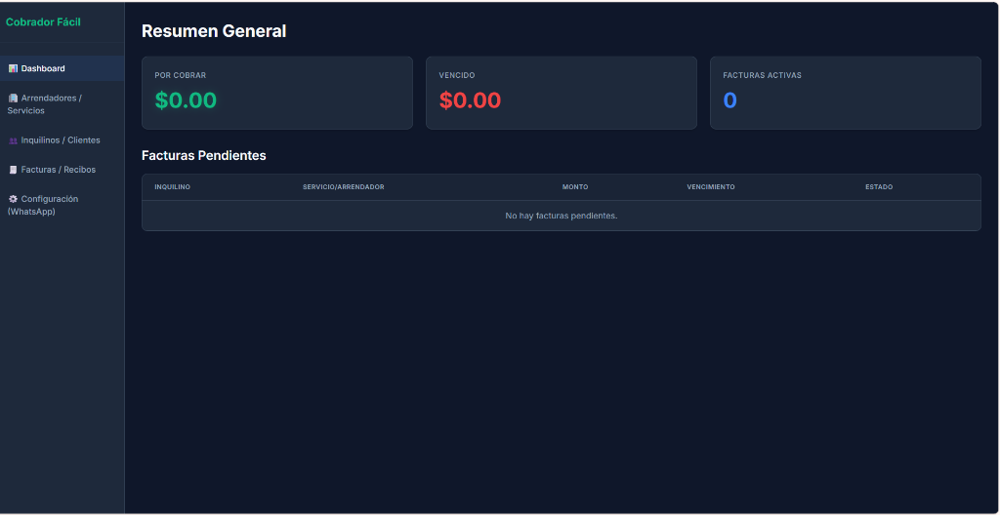
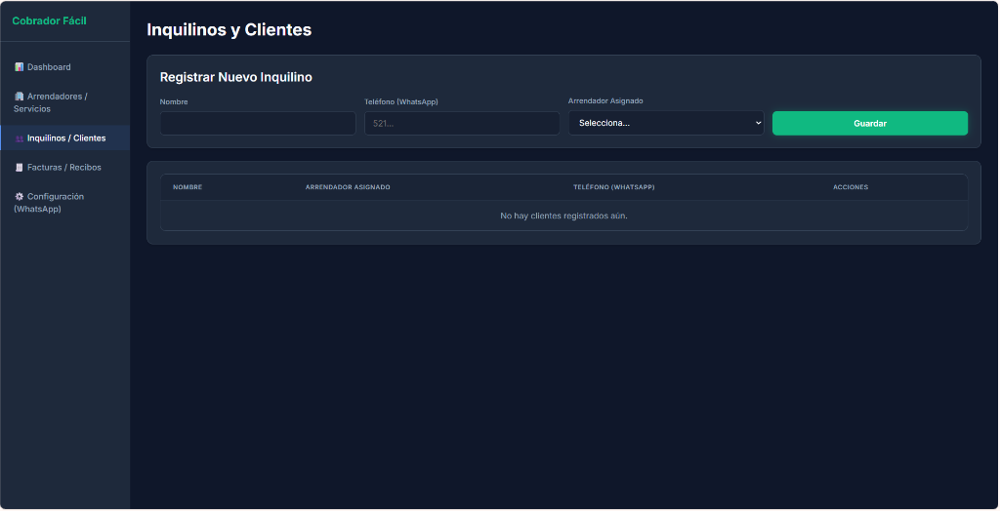
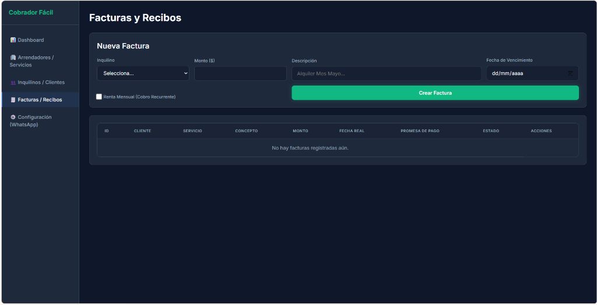
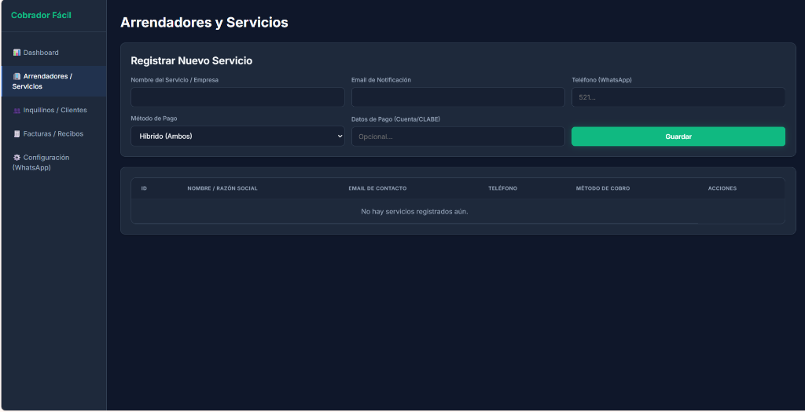
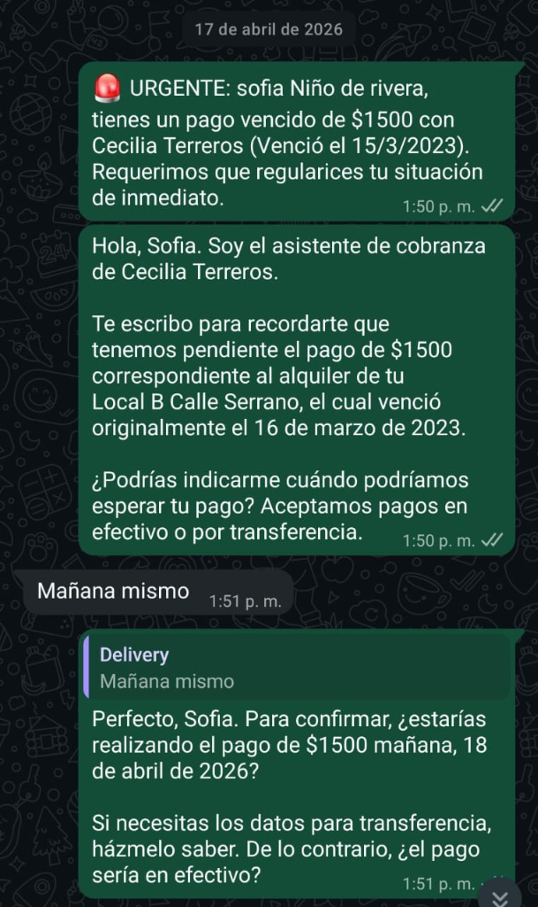
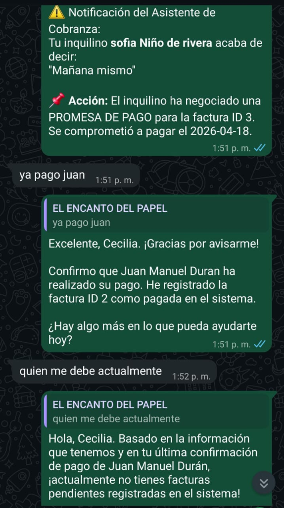

# 🤖 Cobrador Fácil IA — Sistema de Cobranza Autónoma con Inteligencia Artificial

> Sistema SaaS "Full-Stack" de administración de rentas y servicios. Integra un panel de control web y un agente autónomo de WhatsApp (potenciado por Gemini IA) capaz de cobrar a los inquilinos, negociar promesas de pago y actualizar la base de datos interpretando lenguaje natural.

---

## 📸 Vistas del Panel Web (React)

| Dashboard Resumen | Gestión de Inquilinos |
|---|---|
|  |  |
| **Generación de Facturas** | **Gestión de Servicios** |
|  |  |

---

## 🤖 El Agente de Cobranza en Acción (WhatsApp)

Este bot no usa respuestas automáticas fijas, sino **Inteligencia Artificial generativa** conectada directamente a la base de datos.

### 1️⃣ Negociación Autónoma con el Inquilino
El agente envía el recordatorio, comprende las intenciones del usuario (ej. *"Mañana mismo"*), calcula la fecha basándose en el día actual y le ofrece métodos de pago, generando internamente una "Promesa de Pago".

### 2️⃣ Asistente Personal para el Arrendador
El administrador recibe notificaciones sobre los compromisos de sus inquilinos. Además, puede **actualizar la base de datos** usando lenguaje natural (Ej. *"ya pago juan"*) y hacer consultas al sistema (Ej. *"quien me debe actualmente"*).

---

## ✨ Características Principales

- **Dashboard Administrativo:** Interfaz gráfica creada con React + Vite para registrar servicios, inquilinos, deudas y revisar métricas (Deuda vencida, Por cobrar, etc.).
- **Tareas Programadas (Cron Jobs):** El sistema revisa la base de datos diariamente y detona alertas de vencimiento de forma automática a través de WhatsApp.
- **Inteligencia Artificial Integrada:** Usa Google Gemini API (Agentic Workflow) donde el bot tiene "herramientas" para leer facturas, marcar pagos completados y crear promesas de pago directamente en SQLite.
- **Flujo Omnicanal:** Sincronización perfecta entre lo que el bot negocia en WhatsApp y lo que se visualiza en el panel web.

---

## 🛠️ Tecnologías

| Herramienta | Uso |
|---|---|
| **React / Vite** | Panel de control visual rápido y moderno |
| **Express / Node.js** | Servidor API REST y procesos en segundo plano |
| **Prisma + SQLite** | Modelado y persistencia relacional de la base de datos |
| **whatsapp-web.js** | Librería para tomar el control de la sesión de WhatsApp |
| **node-cron** | Ejecución automatizada de tareas de facturación |

---

## 📌 Estado del Proyecto

---

## 🔗 Volver al Portafolio

[← Regresar al índice principal](../README.md)
