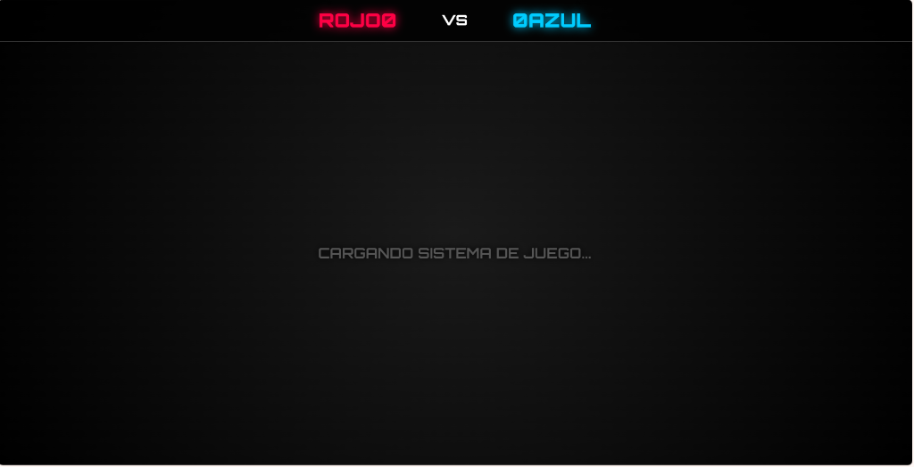
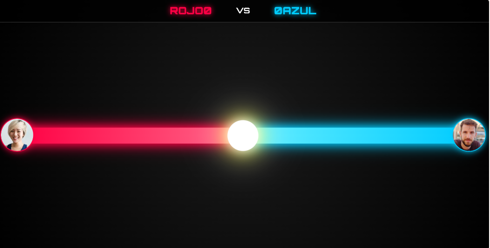

# ⚙️ Mr Games — Framework Modular de Minijuegos (Rojo vs Azul)

> Prototipo de un motor de juegos (Game Engine Shell) desarrollado en Vanilla JS para TikTok LIVE. Su objetivo principal es demostrar una arquitectura de software limpia y modular, permitiendo cargar e intercambiar diferentes minijuegos en tiempo real sin reiniciar el núcleo del sistema.

---

## 📸 Interfaz del Motor Base

| Carga Dinámica del Sistema | Módulo Base Cargado (Tira y Afloja) |
|---|---|
|  |  |

---

## ✨ Arquitectura y Diseño Técnico

A diferencia de un juego monolítico, **Mr Games** fue estructurado utilizando patrones de diseño modulares para escalabilidad.

### 🧠 Core System (Núcleo)
- **Archivos `core.js` y `main.js`:** Se encargan de mantener el estado global de la partida, el marcador persistente de victorias (`ROJO vs AZUL`), las animaciones de la interfaz base y la escucha de la API de TikTok (conexiones WebSocket).
- **Inyector de Juegos:** Capacidad para cargar scripts dinámicamente dependiendo del minijuego seleccionado por el presentador.

### 🧩 Módulos Independientes
El código está dividido en 11 submódulos listos para ser inyectados en el Core:
1. `01_tira_afloja.js` (Mecánica Tug-of-war)
2. `02_carrera.js` (Sistema de avance)
3. `03_pelea.js` (Combate con barra de salud)
4. `04_conquista.js` (Control de zonas)
5. `05_choque.js`, `06_globo.js`, `07_torre.js`, `08_castillo.js`, `09_espacio.js`, `11_bomba.js`
6. `10_spam.js` (Módulo optimizado para disparar el algoritmo de TikTok mediante comentarios masivos).

### 🎨 Diseño Visual UI
- Interfaz genérica con estética *Neón* sobre fondo oscuro, ideal para acoplarse como Overlay en software de streaming (OBS) mediante Chroma o Browser Source.
- Inserción dinámica de avatares (imágenes de perfil) de los usuarios que interactúan en el directo.

---

## 🛠️ Tecnologías

| Herramienta | Uso |
|---|---|
| **Arquitectura Modular** | Separación de estado global (Core) y lógica de juego (Módulos) |
| **Vanilla JS** | Manipulación del DOM en tiempo real y carga dinámica de scripts |
| **Integración TikTok** | Preparado para inyectar eventos JSON de la API de TikTok Live |

---

## 📌 Estado del Proyecto

---

## 🔗 Volver al Portafolio

[← Regresar al índice principal](../README.md)
