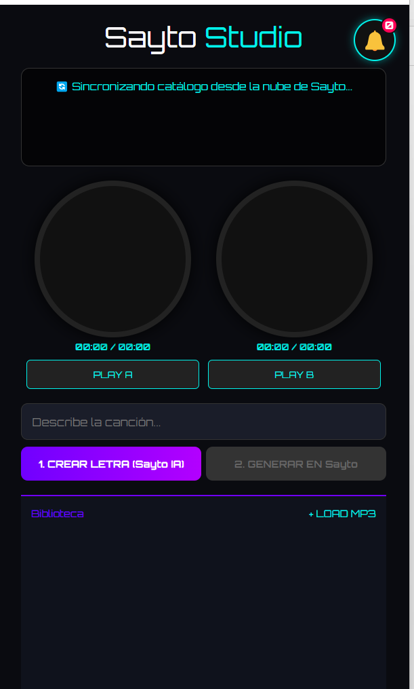
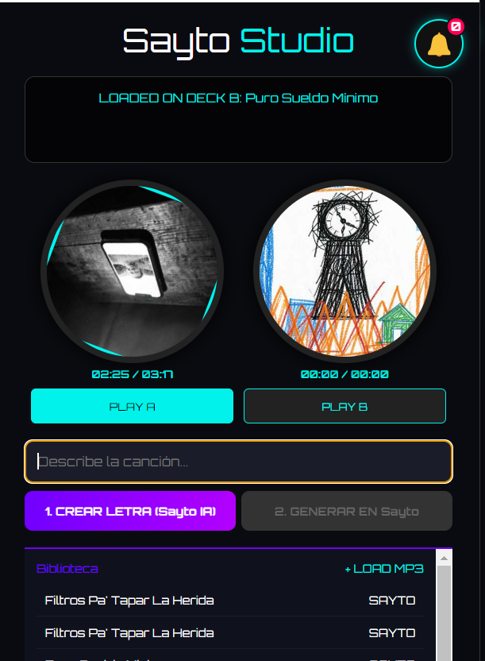

# 🎵 Sayto Studio — Motor IA de Producción Musical en Vivo

> Aplicación de escritorio personalizada (Wrapper) diseñada para transmisiones de TikTok LIVE. Proporciona una interfaz gráfica estilo "DJ Deck" para el stream, mientras que en segundo plano utiliza automatización de navegadores (Headless Browser) para interactuar secretamente con la IA de Suno y generar canciones en tiempo real sin revelar el proceso al público.

---

## 📸 Interfaz Personalizada (Overlay para Stream)

| Interfaz Base de Generación | Reproducción Simultánea (Decks A y B) |
|---|---|
|  |  |

---

## ✨ Arquitectura y Características

### 🤖 Automatización Invisible (Headless)
El verdadero núcleo del proyecto es su motor de automatización. El usuario describe una canción en la interfaz gráfica y el sistema usa **Puppeteer Stealth** para:
1. Abrir una instancia oculta del navegador.
2. Inyectar las credenciales y evadir sistemas Anti-Bot.
3. Enviar el "Prompt" de la canción al motor real de Suno AI.
4. Extraer el `.mp3` y las portadas (Covers) generadas, devolviéndolas a la interfaz local.

### 🎧 Interfaz de Producción (Sayto Studio)
- Diseño original estilo software de DJ (Decks independientes para reproducir la Pista A y la Pista B).
- **Biblioteca Musical:** Gestor local que enlista las canciones generadas y permite cargarlas a los reproductores de forma instantánea.
- **Generador de Letras Integrado:** Permite solicitar la estructura lírica a la IA antes de renderizar la pista final de audio.

### 💻 Cliente de Escritorio
Empaquetado como un ejecutable nativo de Windows (`.exe`), garantizando un rendimiento estable para transmisiones de larga duración utilizando OBS Studio.

---

## 🛠️ Tecnologías

| Herramienta | Uso |
|---|---|
| **Electron** | Compilación del entorno web y el motor de Node en una app `.exe` |
| **Puppeteer (Stealth)** | Navegación Headless para el Web Scraping y manipulación del DOM de Suno AI de forma invisible |
| **Vanilla JS** | Lógica de los reproductores de audio, listas de reproducción y manipulación de UI |

---

## 📌 Estado del Proyecto

---

## 🔗 Volver al Portafolio

[← Regresar al índice principal](../README.md)
