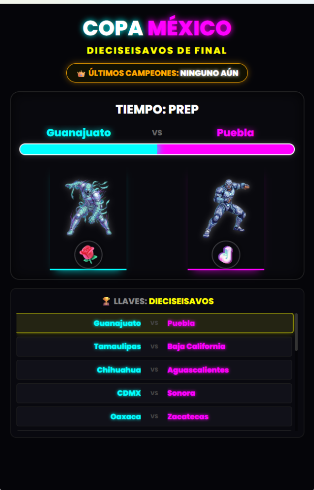
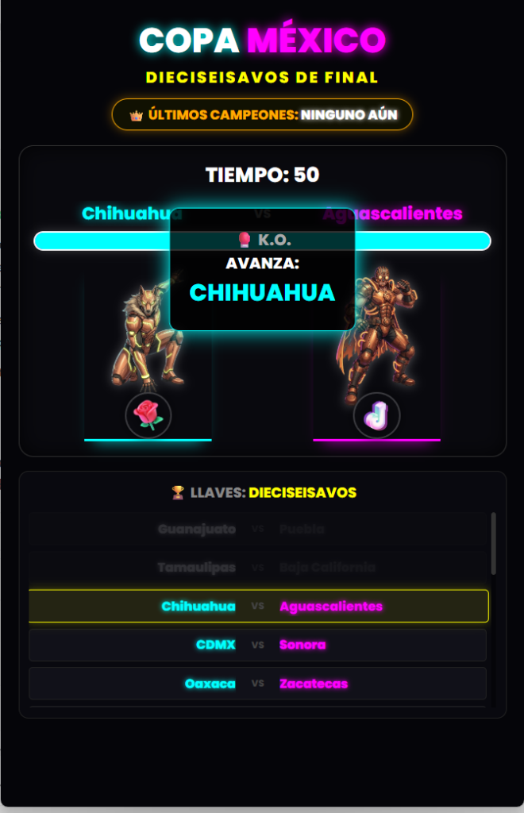
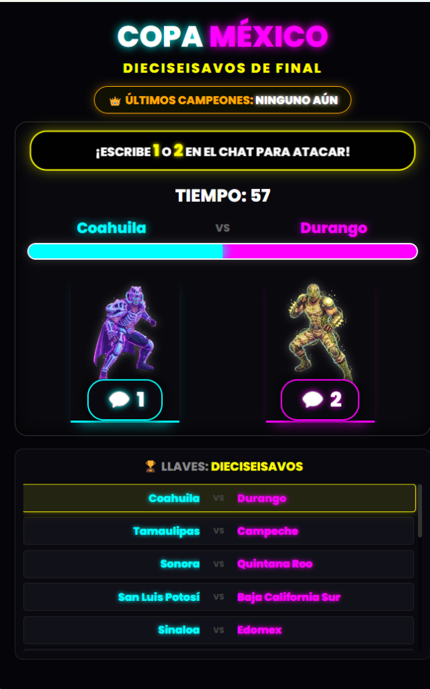
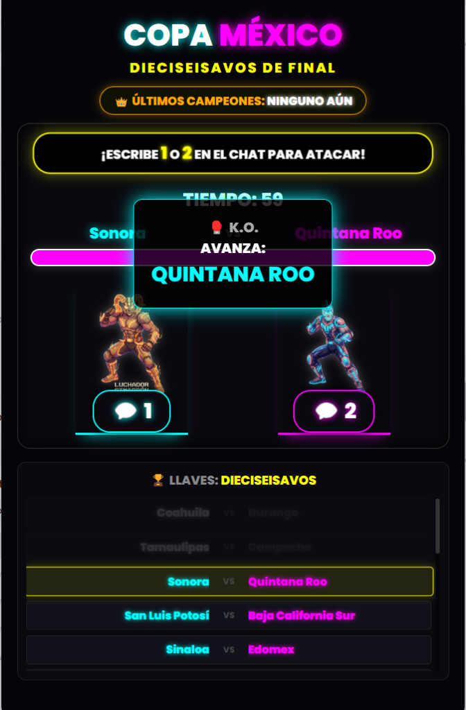

# 🏆 Copa México (Torneos) — Peleas Interactivas para TikTok LIVE

> Sistema de torneos de eliminación directa ("Bracket") diseñado para transmisiones de TikTok LIVE. Los espectadores apoyan a su estado natal enviando regalos virtuales para ganar el "Tira y Afloja" (Tug-of-War) y hacer que su peleador avance a la siguiente ronda.

---

## 📸 Vistas del Torneo

| Fase de Combate (Por Regalos) | Declaración de K.O. y Avance |
|---|---|
|  |  |
| **Fase de Combate (Por Chat)** | **Avance de Ronda** |
|  |  |

---

## ✨ Características

### 🥊 Mecánica de "Tug of War" Multi-Modo
- **Modo Regalos:** El medidor central se empuja cuando los espectadores envían regalos específicos (Rosas vs Monedas).
- **Modo Chat (Algoritmo Boost):** Integración de lectura de chat en tiempo real donde los usuarios escriben "1" o "2". Esta mecánica genera spam positivo que dispara el algoritmo de recomendación de TikTok LIVE.
- **Temporizador y K.O.:** Cada ronda tiene un tiempo límite ("Tiempo: PREP" / "Tiempo: 50s"). Quien tenga la mayor parte de la barra de vida al terminar el tiempo, o quien vacíe la barra del rival, gana automáticamente y avanza de llave.

### 📊 Gestión de Torneos (Brackets)
- **Llaves Dinámicas:** Generador de llaves integrado para 32 participantes (Dieciseisavos, Octavos, Cuartos, Semifinal y Final).
- **Temática Estatal:** Diseñado originalmente como la "Copa México", enfrentando a los distintos estados de la república (Ej. Chihuahua vs Aguascalientes), representados por peleadores con armaduras temáticas/robóticas.

### 💻 Interfaz de Streaming
- Interfaz gráfica limpia en formato vertical, optimizada para capturarse desde OBS Studio.
- Panel inferior que muestra el estado actual de todas las llaves para que la audiencia sepa quién es el siguiente.

---

## 🛠️ Tecnologías

| Herramienta | Uso |
|---|---|
| **Electron** | Compilación del juego web en un ejecutable nativo `.exe` para escritorio |
| **Vanilla JS** | Lógica de la barra de salud, cronómetro y progresión del torneo |
| **Generador de Brackets** | Lógica interna (`generador_torneos.html`) para organizar enfrentamientos |
| **Integración TikTok** | Arquitectura lista para inyectar eventos de regalos (Rosas vs Monedas) |

---

## 📌 Estado del Proyecto

---

## 🔗 Volver al Portafolio

[← Regresar al índice principal](../README.md)
