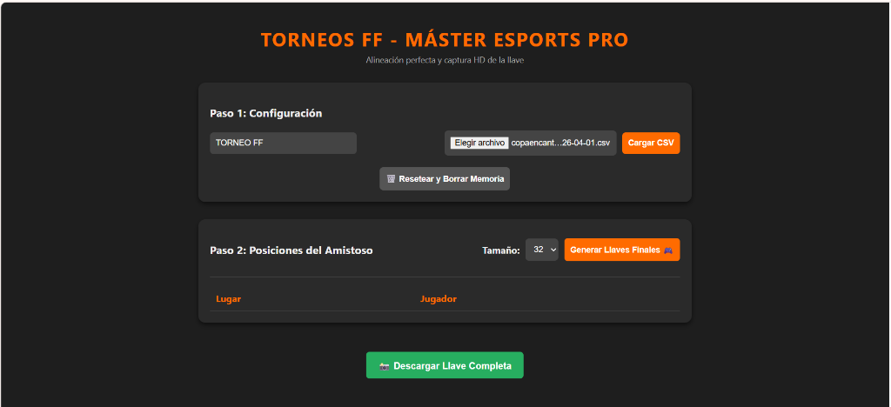
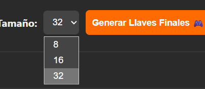
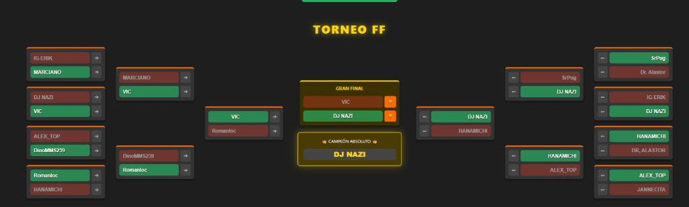
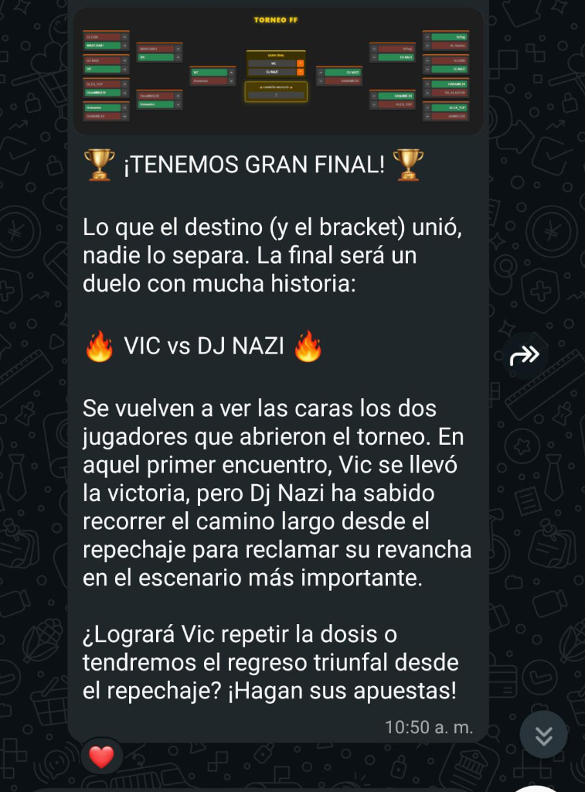

# 🏆 Generador de Llaves eSports & Narrativa IA

> Herramienta administrativa para organizadores de torneos de eSports (como Free Fire). Permite cargar listas de jugadores, generar el "Bracket" visual en distintas capacidades, exportarlo en HD y generar narrativas automáticas para grupos de WhatsApp.

---

## 📸 Interfaz de la Herramienta

| Configuración y Carga de Jugadores | Selector de Tamaño de Torneo |
|---|---|
|  |  |

## 📊 Resultado Generado

| Llave (Bracket) Exportada en HD | Narrativa Generada para WhatsApp |
|---|---|
|  |  |

---

## ✨ Características Principales

### ⚙️ Generación de Brackets
- **Carga Masiva (CSV):** Olvídate de la carga manual. Los organizadores pueden subir un archivo `.csv` con los nombres de los competidores para poblar las llaves al instante.
- **Tamaños Dinámicos:** Soporte nativo para generar y organizar campeonatos de 8, 16 o hasta 32 jugadores simultáneos de forma perfectamente simétrica.
- **Exportación en Alta Calidad:** Al terminar de configurar el torneo, el sistema procesa el DOM (Document Object Model) y lo exporta como una imagen HD lista para compartirse.

### 🤖 Narrativa y Automatización
- **Storytelling Automático:** Capacidad para analizar los cruces de las llaves (ej. *Vic vs DJ Nazi en la Gran Final*) y generar un texto de *"Hype"* narrativo ideal para mantener activos los grupos de WhatsApp de la comunidad eSports.

---

## 🛠️ Tecnologías

| Herramienta | Uso |
|---|---|
| **Vanilla JS** | Lógica de lectura de CSV (`FileReader`), algoritmos de emparejamiento aleatorio y generación de la estructura visual |
| **HTML2Canvas** | Renderizado del código HTML/CSS hacia un archivo de imagen descargable |
| **Integración IA** | Flujo de trabajo para redactar resúmenes narrativos basados en los datos del Bracket |

---

## 📌 Estado del Proyecto

---

## 🔗 Volver al Portafolio

[← Regresar al índice principal](../README.md)
