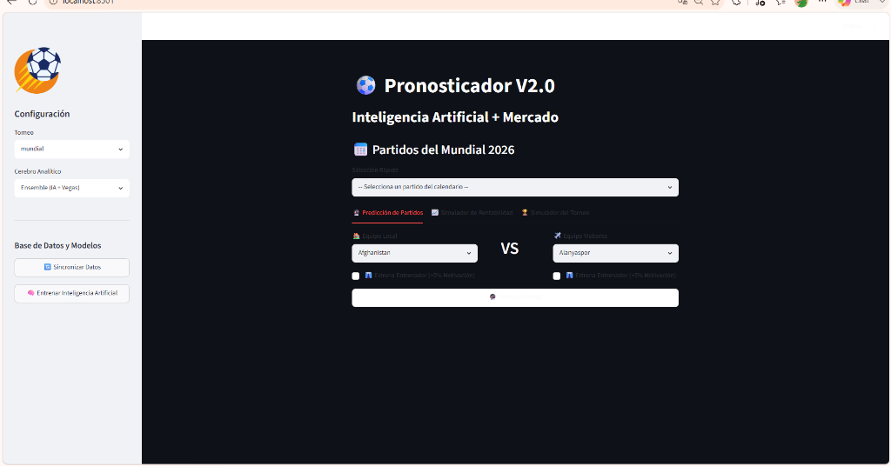
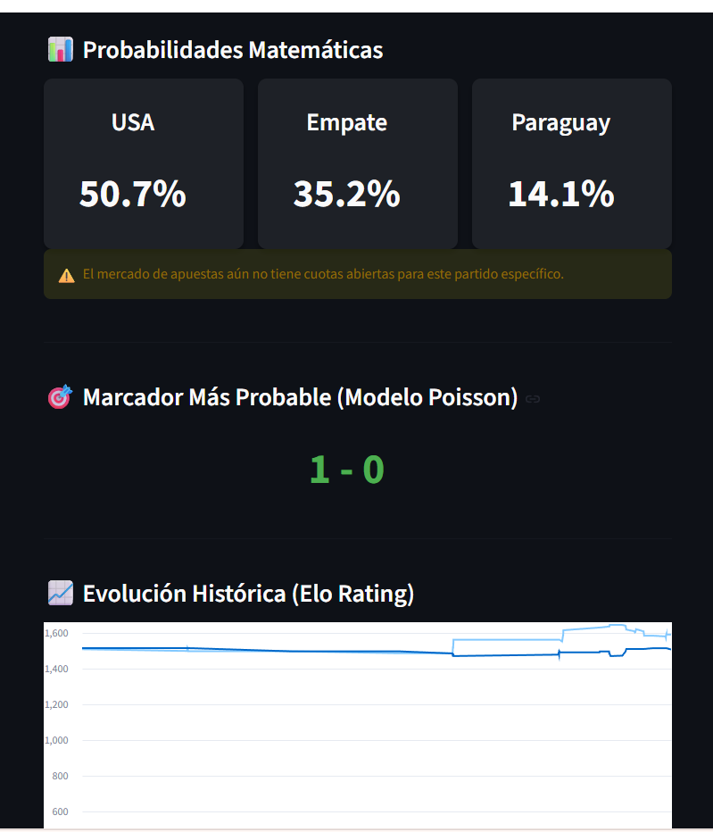
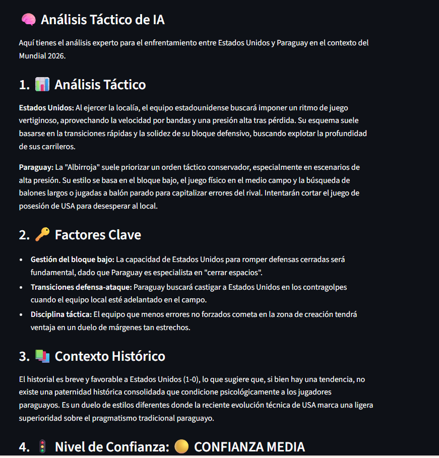
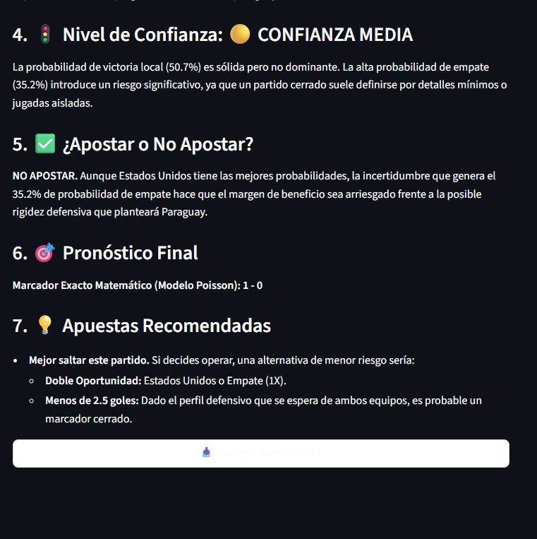

# ⚽ Pronosticador Deportivo V2 — Predicción con IA + Mercado

> Sistema de predicción de partidos de fútbol que combina **Machine Learning** (XGBoost, Poisson, Ensemble) con **Inteligencia Artificial Generativa** (Google Gemini) y datos de mercado de apuestas. **Se alimenta con los partidos que el usuario sincronice** — entre más datos, más preciso el modelo. Interfaz web con Streamlit + CLI rico en la terminal.

---

## 📸 Vistas del Sistema

| Interfaz Principal |
|---|
|  |

| Probabilidades + Marcador Poisson + Gráfica Elo |
|---|
|  |

**🧠 Análisis Táctico de IA (Google Gemini)**
| Análisis — Parte 1 | Análisis — Parte 2 |
|---|---|
|  |  |
```
⚽  PRONOSTICADOR DEPORTIVO  ⚽
Sistema de predicción con IA — Versión 0.1.0

📊 Métricas — XGBOOST
┌──────────────────────┬────────┬─────────┐
│ Métrica              │ Valor  │ Calidad │
├──────────────────────┼────────┼─────────┤
│ Precisión (Accuracy) │ 0.5270 │    ●    │
│ Brier Score          │ 0.6013 │    ●    │
│ Log Loss             │ 1.0252 │    ●    │
└──────────────────────┴────────┴─────────┘

📈 Top Features: elo_diff, elo_home, elo_away,
   h2h_draws, goal_diff_home, rest_days_home...

✅ Modelo entrenado con 2,664 partidos del Mundial
```

---

## ✨ Características

- 🌐 **Interfaz Streamlit** — App web en `localhost:8501`
- 🤖 **Múltiples modelos de ML**: XGBoost, Poisson, Ensemble (IA + Vegas)
- 📊 **Probabilidades matemáticas** — % de victoria local, empate y visitante
- 🎯 **Marcador más probable** calculado con distribución de Poisson
- 📈 **Gráfica de Evolución Elo** histórica por equipo
- 🧠 **Análisis Táctico completo con Google Gemini**:
  - Estilos de juego de cada equipo
  - Factores clave del partido
  - Contexto histórico (H2H)
  - Nivel de confianza del pronóstico
  - Recomendación de apuesta razonada
  - Pronóstico final con marcador exacto
- 📄 **Exportación a PDF** del análisis completo
- 🏆 **Múltiples torneos**: Mundial, ligas de todo el mundo
- 📈 **Simulador de torneos** completo
- 🔄 **Sincronización de datos** desde APIs externas — el usuario puede agregar partidos de cualquier liga y torneo
- 🧠 **Entrena la IA** directamente desde el panel — entre más partidos sincronices, más preciso el modelo
- ⚡ **"Cerebro Analítico"** configurable: XGBoost, Poisson o Ensemble (IA+Vegas)

---

## 🛠️ Tecnologías


| Librería | Uso |
|---|---|
| **Streamlit** | Interfaz web interactiva |
| **XGBoost** | Modelo de ML de gradiente boosting |
| **Distribución de Poisson** | Modelo estadístico de predicción de goles |
| **Ensemble** | Combinación de modelos + datos de mercado (Vegas) |
| **Google Gemini** | Análisis narrativo con IA generativa |
| **Rich** | Terminal con tablas, colores y paneles |
| **SQLite** | Persistencia de datos y modelos |
| **Uvicorn** | Servidor para Streamlit |

---

## 📊 Ejemplo de Métricas (una sesión de entrenamiento)

> Las métricas varían según los partidos sincronizados por el usuario.

| Modelo | Accuracy | Brier Score |
|---|---|---|
| **XGBoost** | ~52-55% | ~0.60 |
| **Poisson** | ~51-54% | ~0.59 |

**Top 10 Features más importantes:**
`elo_diff` · `elo_home` · `elo_away` · `h2h_draws` · `goal_diff_home` · `gf_away` · `rest_days_home` · `h2h_avg_goals` · `h2h_home_wins` · `gc_home`

---

## 🔄 Flujo del Sistema

```
APIs externas (partidos, lesiones, cuotas)
        ↓
Sincronizar Datos → SQLite
        ↓
Ingeniería de Features (Elo, H2H, forma, descanso...)
        ↓
Entrenar modelos: XGBoost / Poisson / Ensemble
        ↓
Streamlit UI → Seleccionar partido → Predecir
        ↓
Gemini AI → Narrativa y contexto del pronóstico
```

---

## 📁 Estructura del Proyecto

```
pronosticador/
├── src/pronosticador/
│   ├── ai/              # Integración con Google Gemini
│   ├── cli/             # CLI con Click + Rich
│   ├── config.py        # Configuración con Pydantic Settings
│   ├── data/
│   │   └── collectors/  # Conectores a APIs externas
│   ├── features/        # Ingeniería de features (Elo, H2H...)
│   ├── models/          # XGBoost, Poisson, Ensemble
│   └── evaluation/      # Métricas y calibración
├── data/
│   ├── raw/             # Datos crudos de APIs
│   └── processed/       # Datos listos para ML
├── models/              # Modelos entrenados (.joblib)
└── pyproject.toml
```

---

## ⚠️ Aviso Legal

> Este proyecto es únicamente con fines **educativos e informativos**. Las predicciones no constituyen asesoramiento financiero. El desarrollador no se hace responsable de pérdidas derivadas del uso de esta herramienta.

---

## 📌 Estado del Proyecto


---

## 🔗 Volver al Portafolio

[← Regresar al índice principal](../README.md)
