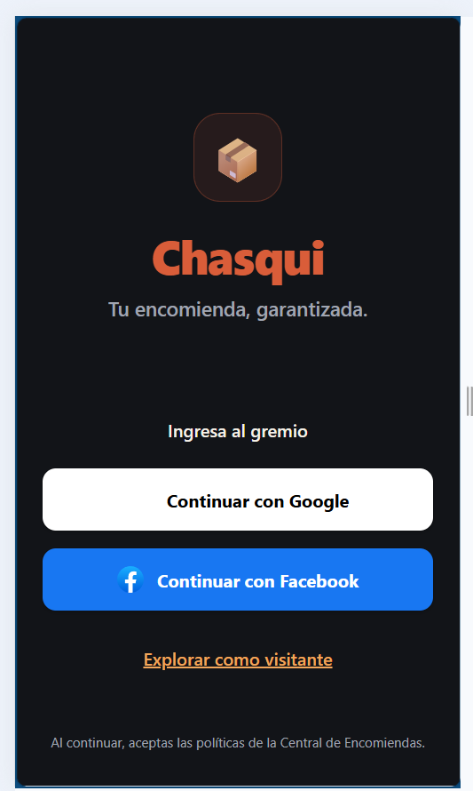
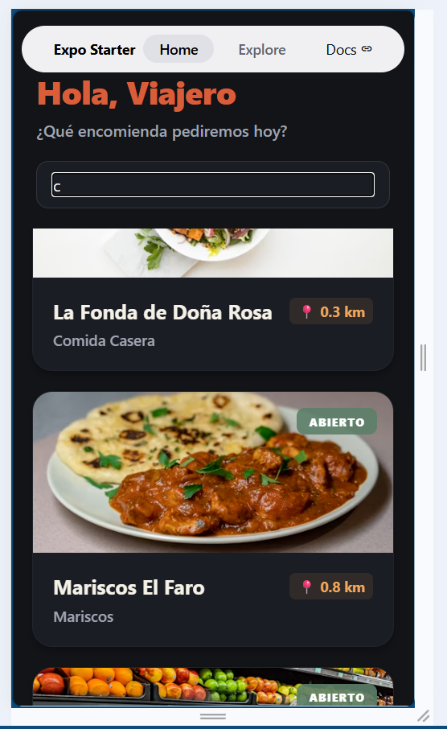
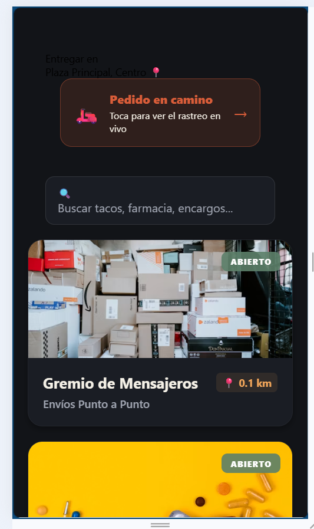

# 🛵 Chasqui — App de Delivery y Encomiendas

> *"Tu encomienda, garantizada."*
>
> Plataforma completa de delivery local que conecta clientes con negocios (restaurantes, farmacias, mensajeros) con **rastreo de pedido en vivo**. Incluye app móvil para clientes y panel web para superadmin.

---

## 📸 Vistas del Sistema

| Login / Splash | Home — Negocios cercanos |
|---|---|
|  |  |

| Pedido en camino — Rastreo en vivo |
|---|
|  |

---

## ✨ Características

### 📱 App Cliente (React Native + Expo)
- 🔐 **Autenticación** con Google y Facebook (OAuth)
- 🗺️ **Negocios cercanos** con distancia en km en tiempo real
- 🔍 **Búsqueda** de tacos, farmacia, encargos y más
- 🏪 **Múltiples categorías** de negocios:
  - 🍽️ Restaurantes (Comida casera, Mariscos...)
  - 📦 Mensajeros (Envíos Punto a Punto)
  - 💊 Farmacias
  - 🛒 Encargos en general
- 🚴 **Rastreo en vivo** del repartidor — "Pedido en camino"
- 🌐 Modo visitante sin necesidad de registro

### 🖥️ Panel Superadmin (React + Vite)
- Gestión de negocios y categorías
- Control de repartidores (Gremio)
- Administración de pedidos

### 🏍️ Gremio de Repartidores
- Registro independiente para repartidores
- Listado de pedidos disponibles
- Sistema de envíos Punto a Punto

---

## 🛠️ Tecnologías


**App Móvil (cliente)**
| Librería | Uso |
|---|---|
| **React Native 0.85** | Framework móvil iOS/Android |
| **Expo SDK 56** | Plataforma de desarrollo y build |
| **Expo Router** | Navegación por rutas de archivos |
| **Firebase 12** | Auth (Google/Facebook), BD en tiempo real |
| **expo-location** | GPS y distancia en tiempo real |
| **React Native Reanimated** | Animaciones fluidas |
| **expo-glass-effect** | Efectos visuales glassmorphism |

**Panel Superadmin**
| Librería | Uso |
|---|---|
| **React 19 + Vite** | Panel web de administración |
| **TypeScript** | Tipado estático |
| **Firebase** | Backend compartido |
| **lucide-react** | Íconos del panel |

---

## 📁 Estructura del Proyecto

```
proyecto-delivery/
├── cliente/              ← App móvil (React Native + Expo)
│   ├── src/
│   │   ├── app/          ← Rutas (Expo Router)
│   │   ├── components/   ← Componentes reutilizables
│   │   └── services/     ← Firebase, geolocalización
│   └── assets/           ← Íconos y splash screen
└── superadmin/           ← Panel web (React + Vite)
    └── src/
        ├── pages/        ← Vistas del panel
        └── components/   ← UI del superadmin
```

---

## 📌 Estado del Proyecto


---

## 🔗 Volver al Portafolio

[← Regresar al índice principal](../README.md)
