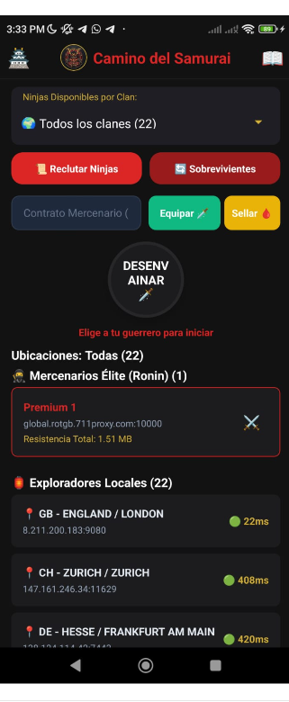
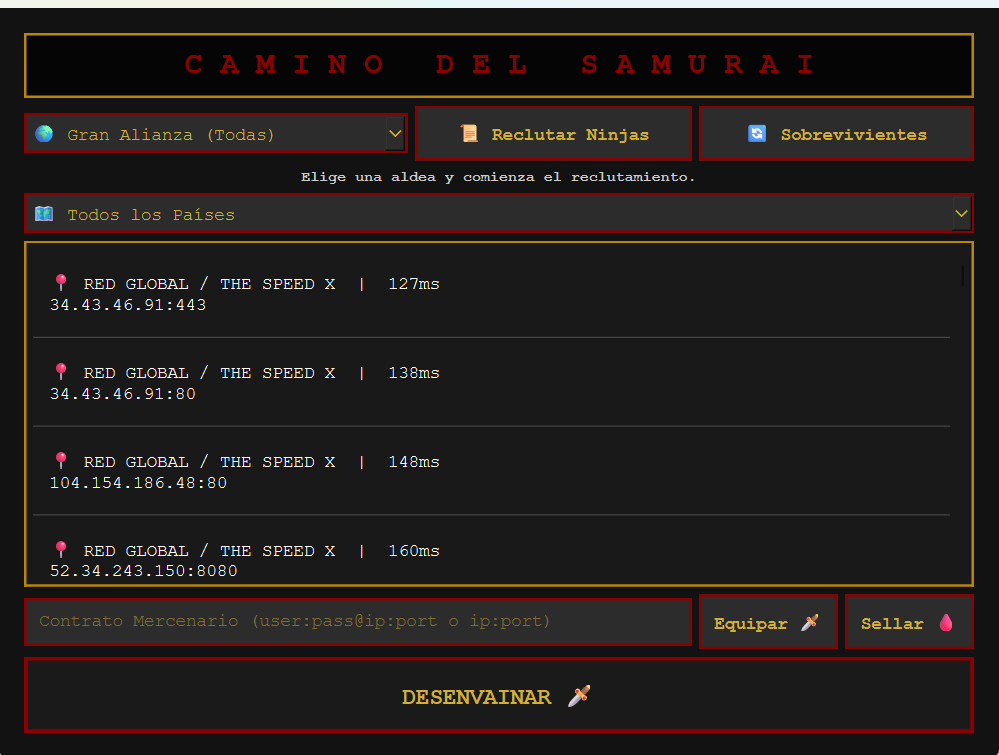

# 🥷 Camino del Samurai — VPN con Servidores Gratuitos

> App con temática de **ninjas y samurais** que obtiene servidores proxy/VPN gratuitos desde APIs públicas y los conecta automáticamente. Disponible en **Android** (React Native) y **Windows** (Python + exe).

---

## 📸 Vistas del Sistema

| Android | Desktop (Windows) |
|---|---|
|  |  |

---

## ✨ Características

### 🗡️ Temática Ninja
- Los **servidores** son "Ninjas" agrupados por clan (país)
- **Reclutar Ninjas** — obtiene nuevos servidores de APIs gratuitas
- **Sobrevivientes** — muestra los servidores activos
- **Mercenarios Élite (Ronin)** — servidores premium
- **Exploradores Locales** — servidores gratuitos con ping en tiempo real
- **Desenvainar** — conecta al servidor seleccionado
- **Sellar** — desconecta la VPN

### 🌍 Servidores por País (Clanes)
- Muestra todos los clanes disponibles con bandera del país
- Latencia en tiempo real (ej: 🟢 22ms, 🟡 408ms)
- Ubicación detallada: país, ciudad y servidor

### 🔄 Obtención Automática
- Conecta a **APIs gratuitas** de proxies públicos
- Filtra y prueba los servidores automáticamente
- Guarda los mejores en `samurai_data.json`

---

## 🛠️ Tecnologías

**Versión Android:**


**Versión Desktop (Windows):**


| Archivo | Función |
|---|---|
| `main.py` | App principal con UI |
| `proxy_fetcher.py` | Obtiene servidores de APIs públicas |
| `proxy_tester.py` | Prueba latencia y disponibilidad |
| `windows_proxy.py` | Configura el proxy en Windows |
| `PyInstaller` | Compilado a `.exe` portable |

---

## 📁 Estructura

```
vpn_desktop/
├── main.py              ← App principal
├── proxy_fetcher.py     ← Fetch de APIs gratuitas
├── proxy_tester.py      ← Test de latencia
├── windows_proxy.py     ← Integración con Windows
├── samurai_data.json    ← Caché de servidores
├── bg.png               ← Fondo temático
└── dist/
    └── CaminoDelSamurai.exe ← Ejecutable final
```

---

## 📌 Estado del Proyecto


---

## 🔗 Volver al Portafolio

[← Regresar al índice principal](../README.md)
