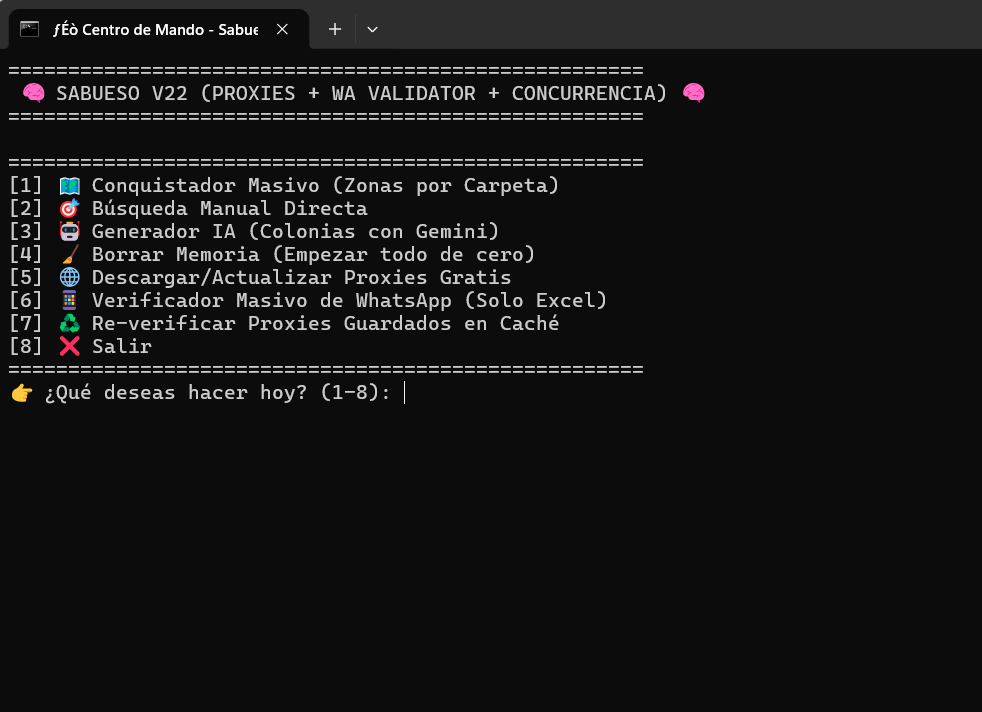
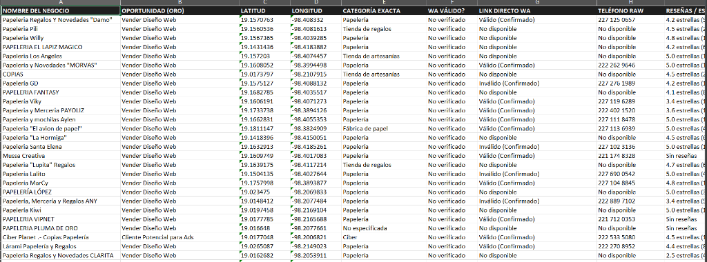

# 🐕 Sabueso Maps V22 — Extractor Masivo de Leads desde Google Maps

> Herramienta de scraping avanzada que extrae **leads de negocios desde Google Maps** con validación de WhatsApp en tiempo real, generación de colonias con IA (Gemini), sistema de proxies rotativos y exportación a Excel con datos de contacto listos para venta. V22 con concurrencia y proxies.

---

## 📸 Vistas del Sistema

| Menú Principal (V22) | Excel de Leads Extraídos |
|---|---|
|  |  |

---

## ✨ Características

### 🗺️ Extracción de Leads
- **Conquistador Masivo** — búsqueda automatizada por zonas organizadas en carpetas
- **Búsqueda Manual Directa** — extrae negocios de una zona específica al instante
- Concurrencia — múltiples búsquedas simultáneas

### 🧠 Generador IA de Colonias
- Usa **Google Gemini** para generar listas de colonias de cualquier ciudad
- Crea automáticamente carpetas de zonas para el Conquistador Masivo

### 📊 Datos Extraídos (Excel)

| Campo | Descripción |
|---|---|
| **Nombre del Negocio** | Razón social del negocio |
| **Oportunidad (ORO)** | Propuesta de venta generada por IA (ej: "Vender Diseño Web") |
| **Latitud / Longitud** | Coordenadas GPS exactas |
| **Categoría Exacta** | Tipo de negocio según Google Maps |
| **WA Válido?** | Si el número de WhatsApp existe y está activo |
| **Link Directo WA** | URL directa para abrir WhatsApp con ese número |
| **Teléfono Raw** | Número de teléfono original |
| **Reseñas / Estrellas** | Reputación del negocio en Google |

### 📱 Verificador Masivo de WhatsApp
- Valida listas de teléfonos desde Excel
- Detecta si el número tiene WhatsApp activo
- Marca como: `Válido (Confirmado)`, `Inválido (Confirmado)`, `No disponible`

### 🌐 Sistema de Proxies
- **Descarga proxies gratuitos** automáticamente desde la web
- Re-verifica proxies en caché para reutilizar los buenos
- Rota proxies para evitar bloqueos de Google Maps

---

## 🛠️ Tecnologías


| Librería | Uso |
|---|---|
| **puppeteer-core + stealth** | Scraping de Google Maps sin detección |
| **@google/generative-ai** | Gemini para generar colonias y oportunidades de venta |
| **exceljs** | Generación y lectura de archivos Excel |
| **dotenv** | Variables de entorno seguras |

---

## 📁 Estructura

```
maps/
├── sabueso_maps.js         ← Motor principal V22
├── Lanzar_Sabueso.bat      ← Lanzador
├── Codigo Postal/          ← Zonas de búsqueda organizadas
├── Leads/                  ← Excel con leads extraídos
├── proxies_validados.json  ← Caché de proxies funcionales
└── progreso.json           ← Estado de búsqueda para reanudar
```

---

## 📌 Estado del Proyecto


---

## 🔗 Volver al Portafolio

[← Regresar al índice principal](../README.md)
